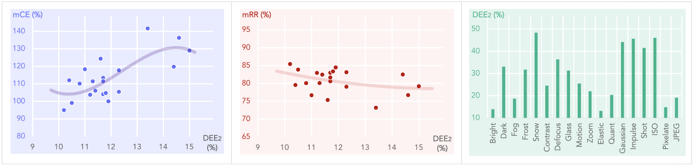
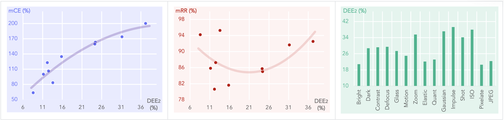
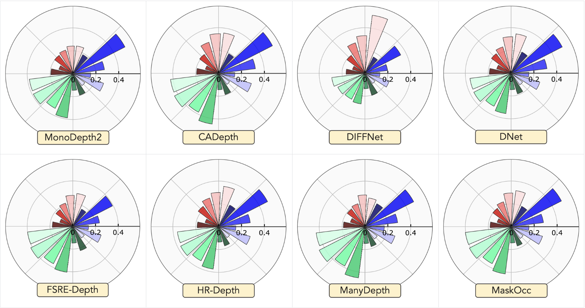

<p align="right">English | <a href="./README_CN.md">简体中文</a></p>

<p align="center">
  
  
  <h3 align="center"><strong>RoboDepth: Robust Out-of-Distribution Depth Estimation under Corruptions</strong></h3>

  <p align="center">
    <a href="https://ldkong.com/">Lingdong Kong</a><sup>1,2</sup>&nbsp;&nbsp;
    <a href="https://github.com/Daniel-xsy">Shaoyuan Xie</a><sup>3</sup>&nbsp;&nbsp;
    <a href="https://hanjianghu.net/">Hanjiang Hu</a><sup>4</sup>&nbsp;&nbsp;
    <a href="https://ipal.cnrs.fr/lai-xing-ng/">Lai Xing Ng</a><sup>2,5</sup>&nbsp;&nbsp;
    <a href="https://scholar.google.com/citations?user=9I7uKooAAAAJ">Benoit R. Cottereau</a><sup>2,6</sup>&nbsp;&nbsp;
    <a href="https://www.comp.nus.edu.sg/cs/people/ooiwt/">Wei Tsang Ooi</a><sup>1,2</sup>
    <br>
    <sup>1</sup>National University of Singapore&nbsp;&nbsp;&nbsp;
    <sup>2</sup>CNRS@CREATE&nbsp;&nbsp;&nbsp;
    <sup>3</sup>University of California, Irvine&nbsp;&nbsp;&nbsp;
    <sup>4</sup>Carnegie Mellon University&nbsp;&nbsp;&nbsp;
    <sup>5</sup>Institute for Infocomm Research, A*STAR&nbsp;&nbsp;&nbsp;
    <sup>6</sup>CNRS
  </p>
</p>

<p align="center">
  <a href="https://arxiv.org/abs/2310.15171" target='_blank'>
    
  </a>
  
  <a href="https://ldkong.com/RoboDepth" target='_blank'>
    
  </a>
  
  <a href="https://huggingface.co/spaces/ldkong/RoboDepth" target='_blank'>
    
  </a>
  
  <a href="https://zhuanlan.zhihu.com/p/592479725" target='_blank'>
    
  </a>
  
  <a href="" target='_blank'>
    
  </a>
</p>


## About
**RoboDepth** is a comprehensive evaluation benchmark designed for probing the **robustness** of monocular depth estimation algorithms. It includes **18 common corruption** types, ranging from weather and lighting conditions, sensor failure and movement, and noises during data processing.

<p align="center">
  
</p>


## Updates
- \[2024.01\] - The [toolkit](https://github.com/robodrive-24/toolkit) tailored for the [RoboDrive Challenge](https://robodrive-24.github.io/) has been released. :hammer_and_wrench:
- \[2023.12\] - We are hosting the [RoboDrive Challenge](https://robodrive-24.github.io/) at [ICRA 2024](https://2024.ieee-icra.org/). :blue_car:
- \[2023.09\] - [RoboDepth](https://arxiv.org/abs/2310.15171) was accepted to [NeurIPS 2023](https://neurips.cc/) Track on Datasets and Benchmarks! :tada:
- \[2023.08\] - We support robust depth estimation on **real-world** scenarios, including `nuScenes`, `nuScenes-Night`, `Cityscapes`, and `Foggy-Cityscapes`. See [here](https://github.com/ldkong1205/RoboDepth/blob/main/docs/VALIDITY.md) for more details.
- \[2023.08\] - We establish the `nuScenes-C` benchmark for robust **multi-view** depth estimation. See [here](https://github.com/ldkong1205/RoboDepth/blob/main/docs/RESULT.md#blue_car-nuscenes-c) for more details.
- \[2023.07\] - The [technical report](https://arxiv.org/abs/2307.15061) of the [RoboDepth Challenge](https://robodepth.github.io/) is available on arXiv.
- \[2023.06\] - We have successfully concluded the [RoboDepth Challenge](https://robodepth.github.io/)! Key statistics of this competition: `226` teams registered at CodaLab, `66` of which made a total number of `1137` valid submissions. More details are included in [these slides](https://ldkong.com/talks/icra23_robodepth.pdf). We thank the exceptional support from our participants! :heart:
- \[2023.06\] - We are glad to announce the winning teams of this competition:
  - **Track 1:** :1st_place_medal: `OpenSpaceAI`, :2nd_place_medal: `USTC-IAT-United`, :3rd_place_medal: `YYQ`.
  - **Track 2:** :1st_place_medal: `USTCxNetEaseFuxi`, :2nd_place_medal: `OpenSpaceAI`, :3rd_place_medal: `GANCV`.
  - **Innovation Prize:** :medal_military: `Scent-Depth`, :medal_military: `Ensemble`, :medal_military: `AIIA-RDepth`.
- \[2023.06\] - The [video recordings](https://www.youtube.com/watch?v=mYhdTGiIGCY&list=PLxxrIfcH-qBGZ6x_e1AT2_YnAxiHIKtkB) of the [RoboDepth Workshop](https://robodepth.github.io/) are out. Know more details about how our participants were dedicated to improving the robustness of depth estimation models. :movie_camera:
- \[2023.05\] - Glad to announce that the [RoboDepth Challenge](https://robodepth.github.io/) will be sponsored by [Baidu Research](http://research.baidu.com/). :beers:
- \[2023.01\] - The `NYUDepth2-C` dataset is ready to be downloaded! See [here](docs/DATA_PREPARE.md) for more details.
- \[2023.01\] - Evaluation server for Track 2 (fully-supervised depth estimation) is available on [this](https://codalab.lisn.upsaclay.fr/competitions/9821) page.
- \[2023.01\] - Evaluation server for Track 1 (self-supervised depth estimation) is available on [this](https://codalab.lisn.upsaclay.fr/competitions/9418) page.
- \[2022.11\] - We are organizing the [RoboDepth Challenge](https://robodepth.github.io/) at [ICRA 2023](https://www.icra2023.org/). Join the challenge today! :raising_hand:
- \[2022.11\] - The `KITTI-C` dataset is ready to be downloaded! See [here](docs/DATA_PREPARE.md) for more details.


## Outline
- [Installation](#installation)
- [Data Preparation](#data-preparation)
- [Getting Started](#getting-started)
- [Model Zoo](#model-zoo)
- [Benchmark](#benchmark)
- [Idiosyncrasy Analysis](#idiosyncrasy-analysis)
- [Create Corruption Sets](#create-corruption-sets)
- [TODO List](#todo-list)
- [Citation](#citation)
- [License](#license)
- [Acknowledgements](#acknowledgements)


## Installation
Kindly refer to [INSTALL.md](docs/INSTALL.md) for the installation details.


## Data Preparation
Our datasets are hosted by [OpenDataLab](https://opendatalab.com/).
><br>
> OpenDataLab is a pioneering open data platform for the large AI model era, making datasets accessible. By using OpenDataLab, researchers can obtain free formatted datasets in various fields.

### The RoboDepth Benchmark
Kindly refer to [DATA_PREPARE.md](docs/DATA_PREPARE.md) for the details to prepare the <sup>1</sup>[KITTI](http://www.cvlibs.net/datasets/kitti/raw_data.php), <sup>2</sup>[KITTI-C](), <sup>3</sup>[NYUDepth2](https://cs.nyu.edu/~silberman/datasets/nyu_depth_v2.html), <sup>4</sup>[NYUDepth2-C](), <sup>5</sup>[Cityscapes](https://www.cityscapes-dataset.com/), <sup>6</sup>[Foggy-Cityscapes](https://paperswithcode.com/dataset/foggy-cityscapes), <sup>7</sup>[nuScenes](https://www.nuscenes.org/nuscenes), and <sup>8</sup>[nuScenes-C](), datasets.

### Competition @ ICRA 2023
Kindly refer to [this](https://github.com/ldkong1205/RoboDepth/blob/main/competition/README.md) page for the details to prepare the training and evaluation data associated with the [1st RoboDepth Competition](https://robodepth.github.io/) at the 40th IEEE Conference on Robotics and Automation ([ICRA 2023](https://www.icra2023.org/)).


## Getting Started
Kindly refer to [GET_STARTED.md](docs/GET_STARTED.md) to learn more usage about this codebase.


## Model Zoo

### :oncoming_automobile: - Outdoor Depth Estimation

<details open>
<summary>&nbsp<b>Self-Supervised Depth Estimation</b></summary>

> - [x] **[MonoDepth2](https://arxiv.org/abs/1806.01260), ICCV 2019.** <sup>[**`[Code]`**](https://github.com/nianticlabs/monodepth2)</sup>
> - [x] **[DepthHints](https://arxiv.org/abs/1909.09051), ICCV 2019.** <sup>[**`[Code]`**](https://github.com/nianticlabs/depth-hints)</sup>
> - [x] **[MaskOcc](https://arxiv.org/abs/1908.11112), arXiv 2019.** <sup>[**`[Code]`**](https://github.com/schelv/monodepth2)</sup>
> - [x] **[DNet](https://arxiv.org/abs/2004.05560), IROS 2020.** <sup>[**`[Code]`**](https://github.com/TJ-IPLab/DNet)</sup>
> - [ ] **[SGDepth](https://arxiv.org/abs/2007.06936), ECCV 2020.** <sup>[**`[Code]`**](https://github.com/ifnspaml/SGDepth)</sup>
> - [x] **[CADepth](https://arxiv.org/abs/2112.13047), 3DV 2021.** <sup>[**`[Code]`**](https://github.com/kamiLight/CADepth-master)</sup>
> - [ ] **[TC-Depth](https://arxiv.org/abs/2110.08192), 3DV 2021.** <sup>[**`[Code]`**](https://github.com/DaoyiG/TC-Depth)</sup>
> - [x] **[HR-Depth](https://arxiv.org/abs/2012.07356), AAAI 2021.** <sup>[**`[Code]`**](https://github.com/shawLyu/HR-Depth)</sup>
> - [ ] **[Insta-DM](https://arxiv.org/abs/2102.02629), AAAI 2021.** <sup>[**`[Code]`**](https://github.com/SeokjuLee/Insta-DM)</sup>
> - [x] **[DIFFNet](https://arxiv.org/abs/2110.09482), BMVC 2021.** <sup>[**`[Code]`**](https://github.com/brandleyzhou/DIFFNet)</sup>
> - [x] **[ManyDepth](https://arxiv.org/abs/2104.14540), CVPR 2021.** <sup>[**`[Code]`**](https://github.com/nianticlabs/manydepth)</sup>
> - [ ] **[EPCDepth](https://arxiv.org/abs/2109.12484), ICCV 2021.** <sup>[**`[Code]`**](https://github.com/prstrive/EPCDepth)</sup>
> - [x] **[FSRE-Depth](http://arxiv.org/abs/2108.08829), ICCV 2021.** <sup>[**`[Code]`**](https://github.com/hyBlue/FSRE-Depth)</sup>
> - [ ] **[R-MSFM](https://openaccess.thecvf.com/content/ICCV2021/papers/Zhou_R-MSFM_Recurrent_Multi-Scale_Feature_Modulation_for_Monocular_Depth_Estimating_ICCV_2021_paper.pdf), ICCV 2021.** <sup>[**`[Code]`**](https://github.com/jsczzzk/R-MSFM)</sup>
> - [x] **[MonoViT](https://arxiv.org/abs/2208.03543), 3DV 2022.** <sup>[**`[Code]`**](https://github.com/zxcqlf/MonoViT)</sup>
> - [ ] **[DepthFormer](https://arxiv.org/abs/2204.07616), CVPR 2022.** <sup>[**`[Code]`**](https://github.com/TRI-ML/vidar)</sup>
> - [x] **[DynaDepth](https://arxiv.org/abs/2207.04680), ECCV 2022.** <sup>[**`[Code]`**](https://github.com/SenZHANG-GitHub/ekf-imu-depth)</sup>
> - [ ] **[DynamicDepth](https://arxiv.org/abs/2203.15174), ECCV 2022.** <sup>[**`[Code]`**](https://github.com/AutoAILab/DynamicDepth)</sup>
> - [x] **[RA-Depth](https://arxiv.org/abs/2207.11984), ECCV 2022.** <sup>[**`[Code]`**](https://github.com/hmhemu/RA-Depth)</sup>
> - [ ] **[Dyna-DM](https://arxiv.org/abs/2206.03799), arXiv 2022.** <sup>[**`[Code]`**](https://github.com/kieran514/dyna-dm)</sup>
> - [x] **[TriDepth](https://arxiv.org/abs/2210.00411), WACV 2023.** <sup>[**`[Code]`**](https://github.com/xingyuuchen/tri-depth)</sup>
> - [ ] **[FreqAwareDepth](https://arxiv.org/abs/2210.05479), WACV 2023.** <sup>[**`[Code]`**](https://github.com/xingyuuchen/freq-aware-depth)</sup>
> - [x] **[Lite-Mono](https://arxiv.org/abs/2211.13202), CVPR 2023.** <sup>[**`[Code]`**](https://github.com/noahzn/Lite-Mono)</sup>

</details>

<details open>
<summary>&nbsp<b>Self-Supervised Multi-View Depth Estimation</b></summary>

> - [x] **[MonoDepth2](https://arxiv.org/abs/1806.01260), ICCV 2019.** <sup>[**`[Code]`**](https://github.com/nianticlabs/monodepth2)</sup>
> - [x] **[SurroundDepth](https://arxiv.org/abs/2204.03636), CoRL 2022.** <sup>[**`[Code]`**](https://github.com/weiyithu/SurroundDepth)</sup>

</details>

<details open>
<summary>&nbsp<b>Fully-Supervised Depth Estimation</b></summary>

> - [ ] **[AdaBins](https://arxiv.org/abs/2011.14141), CVPR 2021.** <sup>[**`[Code]`**](https://github.com/zhyever/Monocular-Depth-Estimation-Toolbox/tree/main/configs/adabins)</sup>
> - [ ] **[NeWCRFs](https://arxiv.org/abs/2203.01502), CVPR 2022.** <sup>[**`[Code]`**](https://github.com/aliyun/NeWCRFs)</sup>
> - [ ] **[DepthFormer](https://arxiv.org/abs/2203.14211), arXiv 2022.** <sup>[**`[Code]`**](https://github.com/zhyever/Monocular-Depth-Estimation-Toolbox/tree/main/configs/depthformer)</sup>
> - [ ] **[GLPDepth](https://arxiv.org/abs/2201.07436), arXiv 2022.** <sup>[**`[Code]`**](https://github.com/vinvino02/GLPDepth)</sup>

</details>

<details open>
<summary>&nbsp<b>Semi-Supervised Depth Estimation</b></summary>

> - [ ] **[MaskingDepth](https://arxiv.org/abs/2212.10806), arXiv 2022.** <sup>[**`[Code]`**](https://github.com/KU-CVLAB/MaskingDepth)</sup>

</details>


### :house: - Indoor Depth Estimation

<details open>
<summary>&nbsp<b>Self-Supervised Depth Estimation</b></summary>

> - [ ] **[P<sup>2</sup>Net](https://arxiv.org/abs/2007.07696), ECCV 2020.** <sup>[**`[Code]`**](https://github.com/svip-lab/Indoor-SfMLearner)</sup>
> - [ ] **[EPCDepth](https://arxiv.org/abs/2109.12484), ICCV 2021.** <sup>[**`[Code]`**](https://github.com/prstrive/EPCDepth)</sup>

</details>


<details open>
<summary>&nbsp<b>Fully-Supervised Depth Estimation</b></summary>

> - [x] **[BTS](https://arxiv.org/abs/1907.10326), arXiv 2019.** <sup>[**`[Code]`**](https://github.com/zhyever/Monocular-Depth-Estimation-Toolbox/tree/main/configs/bts)</sup>
> - [x] **[AdaBins](https://arxiv.org/abs/2011.14141), CVPR 2021.** <sup>[**`[Code]`**](https://github.com/zhyever/Monocular-Depth-Estimation-Toolbox/tree/main/configs/adabins)</sup>
> - [x] **[DPT](https://arxiv.org/abs/2103.13413), ICCV 2021.** <sup>[**`[Code]`**](https://github.com/zhyever/Monocular-Depth-Estimation-Toolbox/tree/main/configs/dpt)</sup>
> - [x] **[SimIPU](https://arxiv.org/abs/2112.04680), AAAI 2022.** <sup>[**`[Code]`**](https://github.com/zhyever/Monocular-Depth-Estimation-Toolbox/tree/main/configs/simipu)</sup>
> - [ ] **[NeWCRFs](https://arxiv.org/abs/2203.01502), CVPR 2022.** <sup>[**`[Code]`**](https://github.com/aliyun/NeWCRFs)</sup>
> - [ ] **[P3Depth](https://arxiv.org/abs/2204.02091), CVPR 2022.** <sup>[**`[Code]`**](https://github.com/SysCV/P3Depth)</sup>
> - [x] **[DepthFormer](https://arxiv.org/abs/2203.14211), arXiv 2022.** <sup>[**`[Code]`**](https://github.com/zhyever/Monocular-Depth-Estimation-Toolbox/tree/main/configs/depthformer)</sup>
> - [ ] **[GLPDepth](https://arxiv.org/abs/2201.07436), arXiv 2022.** <sup>[**`[Code]`**](https://github.com/vinvino02/GLPDepth)</sup>
> - [x] **[BinsFormer](https://arxiv.org/abs/2204.00987), arXiv 2022.** <sup>[**`[Code]`**](https://github.com/zhyever/Monocular-Depth-Estimation-Toolbox/tree/main/configs/binsformer)</sup>

</details>

<details open>
<summary>&nbsp<b>Semi-Supervised Depth Estimation</b></summary>

> - [ ] **[MaskingDepth](https://arxiv.org/abs/2212.10806), arXiv 2022.** <sup>[**`[Code]`**](https://github.com/KU-CVLAB/MaskingDepth)</sup>

</details>


## Benchmark

**:bar_chart: Metrics:** The following metrics are consistently used in our benchmark:
- Absolute Relative Difference (the lower the better): $\text{Abs Rel} = \frac{1}{|D|}\sum_{pred\in D}\frac{|gt - pred|}{gt}$ .
- Accuracy (the higher the better): $\delta_t = \frac{1}{|D|}|\{\ pred\in D | \max{(\frac{gt}{pred}, \frac{pred}{gt})< 1.25^t}\}| \times 100\\%$ .
- Depth Estimation Error (the lower the better):
  - $\text{DEE}_1 = \text{Abs Rel} - \delta_1 + 1$ ;
  - $\text{DEE}_2 = \frac{\text{Abs Rel} - \delta_1 + 1}{2}$ ;
  - $\text{DEE}_3 = \frac{\text{Abs Rel}}{\delta_1}$ .

- The second *Depth Estimation Error* term ($\text{DEE}_2$) is adopted as the main indicator for evaluating model performance in our RoboDepth benchmark. The following two metrics are adopted to compare between models' robustness:
  - **mCE (the lower the better):** The *average corruption error* (in percentage) of a candidate model compared to the baseline, which is calculated among all corruption types across five severity levels.
  - **mRR (the higher the better):** The *average resilience rate* (in percentage) of a candidate model compared to its "clean" performance, which is calculated among all corruption types across five severity levels.

**:gear: Notation:** Symbol <sup>:star:</sup> denotes the baseline model adopted in *mCE* calculation.


### KITTI-C 

<p align="center">
  
</p>

| Model | Modality | mCE (%) | mRR (%) | Clean | Bright | Dark | Fog | Frost | Snow | Contrast | Defocus | Glass | Motion | Zoom | Elastic| Quant| Gaussian | Impulse | Shot | ISO | Pixelate | JPEG | 
| :-- | :--: | :--: | :--: | :--: | :--: | :--: | :--: | :--: | :--: | :--: | :--: | :--: | :--: | :--: | :--: | :--: | :--: | :--: | :--: | :--: | :--: | :--: |
| [MonoDepth2<sub>R18</sub>]()<sup>:star:</sup> | Mono | 100.00 | 84.46 |  0.119 | 0.130     | 0.280     | 0.155     | 0.277     | 0.511     | 0.187     | 0.244     | 0.242     | 0.216     | 0.201     | 0.129     | 0.193     | 0.384     | 0.389     | 0.340     | 0.388     | 0.145     | 0.196     |
| [MonoDepth2<sub>R18+nopt</sub>]() | Mono | 119.75 | 82.50 | 0.144 | 0.183     | 0.343     | 0.311     | 0.312     | 0.399     | 0.416     | 0.254     | 0.232     | 0.199     | 0.207     | 0.148     | 0.212     | 0.441     | 0.452     | 0.402     | 0.453     | 0.153     | 0.171     |
| [MonoDepth2<sub>R18+HR</sub>]() | Mono | 106.06 | 82.44 | 0.114 | 0.129     | 0.376     | 0.155     | 0.271     | 0.582     | 0.214     | 0.393     | 0.257     | 0.230     | 0.232     | 0.123     | 0.215     | 0.326     | 0.352     | 0.317     | 0.344     | 0.138     | 0.198     |
| [MonoDepth2<sub>R50</sub>]() | Mono | 113.43 | 80.59 | 0.117 | 0.127 | 0.294 | 0.155 | 0.287 | 0.492 | 0.233 | 0.427 | 0.392 | 0.277 | 0.208 | 0.130 | 0.198 | 0.409 | 0.403 | 0.368 | 0.425 | 0.155 | 0.211 |
| [MaskOcc]() | Mono | 104.05 | 82.97 | 0.117 | 0.130 | 0.285 | 0.154 | 0.283 | 0.492 | 0.200 | 0.318 | 0.295 | 0.228 | 0.201 | 0.129 | 0.184 | 0.403 | 0.410 | 0.364 | 0.417 | 0.143 | 0.177 |
| [DNet<sub>R18</sub>]() | Mono | 104.71 | 83.34 | 0.118 | 0.128 | 0.264 | 0.156 | 0.317 | 0.504 | 0.209 | 0.348 | 0.320 | 0.242 | 0.215 | 0.131 | 0.189 | 0.362 | 0.366 | 0.326 | 0.357 | 0.145 | 0.190 |
| [CADepth]() | Mono | 110.11 | 80.07 | 0.108 | 0.121 | 0.300 | 0.142 | 0.324 | 0.529 | 0.193 | 0.356 | 0.347 | 0.285 | 0.208 | 0.121 | 0.192 | 0.423 | 0.433 | 0.383 | 0.448 | 0.144 | 0.195 |
| [HR-Depth]() | Mono | 103.73 | 82.93 | 0.112 | 0.121 | 0.289 | 0.151 | 0.279 | 0.481 | 0.213 | 0.356 | 0.300 | 0.263 | 0.224 | 0.124 | 0.187 | 0.363 | 0.373 | 0.336 | 0.374 | 0.135 | 0.176 |
| [DIFFNet<sub>HRNet</sub>]() | Mono | 94.96 | 85.41 | 0.102 | 0.111 | 0.222 | 0.131 | 0.199 | 0.352 | 0.161 | 0.513 | 0.330 | 0.280 | 0.197 | 0.114 | 0.165 | 0.292 | 0.266 | 0.255 | 0.270 | 0.135 | 0.202 |
| [ManyDepth<sub>single</sub>]() | Mono | 105.41 | 83.11 | 0.123 | 0.135 | 0.274 | 0.169 | 0.288 | 0.479 | 0.227 | 0.254 | 0.279 | 0.211 | 0.194     | 0.134     | 0.189 | 0.430 | 0.450 | 0.387 | 0.452 | 0.147 | 0.182 |
| [FSRE-Depth]() | Mono | 99.05 | 83.86 | 0.109 | 0.128 | 0.261 | 0.139 | 0.237 | 0.393 | 0.170 | 0.291 | 0.273 | 0.214 | 0.185 | 0.119 | 0.179 | 0.400 | 0.414 | 0.370 | 0.407 | 0.147 | 0.224 |
| [MonoViT<sub>MPViT</sub>]() | Mono | 79.33 | 89.15 | 0.099 | 0.106 | 0.243 | 0.116 | 0.213 | 0.275 | 0.119 | 0.180 | 0.204 | 0.163 | 0.179 | 0.118 | 0.146 | 0.310 | 0.293 | 0.271 | 0.290 | 0.162 | 0.154 |
| [MonoViT<sub>MPViT+HR</sub>]() | Mono | 74.95 | 89.72 | 0.094 | 0.102 | 0.238 | 0.114 | 0.225 | 0.269 | 0.117 | 0.145 | 0.171 | 0.145 | 0.184 | 0.108 | 0.145 | 0.302 | 0.277 | 0.259 | 0.285 | 0.135 | 0.148 |
| [DynaDepth<sub>R18</sub>]() | Mono | 110.38 | 81.50 | 0.117 | 0.128 | 0.289 | 0.156 | 0.289 | 0.509 | 0.208 | 0.501 | 0.347 | 0.305 | 0.207 | 0.127 | 0.186 | 0.379 | 0.379 | 0.336 | 0.379 | 0.141 | 0.180 |
| [DynaDepth<sub>R50</sub>]() | Mono | 119.99 | 77.98 | 0.113 | 0.128 | 0.298 | 0.152 | 0.324 | 0.549 | 0.201 | 0.532 | 0.454 | 0.318 | 0.218 | 0.125 | 0.197 | 0.418 | 0.437 | 0.382 | 0.448 | 0.153 | 0.216 |
| [RA-Depth<sub>HRNet</sub>]() | Mono | 112.73 | 78.79 | 0.096 | 0.113 | 0.314 | 0.127 | 0.239 | 0.413 | 0.165 | 0.499 | 0.368 | 0.378 | 0.214 | 0.122 | 0.178 | 0.423 | 0.403 | 0.402 | 0.455 | 0.175 | 0.192 |
| [TriDepth<sub>single</sub>]() | Mono | 109.26 | 81.56 | 0.117 | 0.131 | 0.300 | 0.188 | 0.338 | 0.498 | 0.265 | 0.268 | 0.301 | 0.212 | 0.190 | 0.126 | 0.199 | 0.418 | 0.438 | 0.380 | 0.438 | 0.142 | 0.205 |
| [Lite-Mono<sub>Tiny</sub>]() | Mono | 92.92 | 86.69 | 0.115 | 0.127 | 0.257 | 0.157 | 0.225 | 0.354 | 0.191 | 0.257 | 0.248 | 0.198 | 0.186 | 0.127 | 0.159 | 0.358 | 0.342 | 0.336 | 0.360 | 0.147 | 0.161 |
| [Lite-Mono<sub>Tiny+HR</sub>]() | Mono | 86.71 | 87.63 | 0.106 | 0.119 | 0.227 | 0.139 | 0.282 | 0.370 | 0.166 | 0.216 | 0.201 | 0.190 | 0.202 | 0.116 | 0.146 | 0.320 | 0.291 | 0.286 | 0.312 | 0.148 | 0.167 | 
| [Lite-Mono<sub>Small</sub>]() | Mono | 100.34 | 84.67 | 0.115 | 0.127 | 0.251 | 0.162 | 0.251 | 0.430 | 0.238 | 0.353 | 0.282 | 0.246 | 0.204 | 0.128 | 0.161 | 0.350 | 0.336 | 0.319 | 0.356 | 0.154 | 0.164 |
| [Lite-Mono<sub>Small+HR</sub>]() | Mono | 89.90 | 86.05 | 0.105 | 0.119 | 0.263 | 0.139 | 0.263 | 0.436 | 0.167 | 0.188 | 0.181 | 0.193 | 0.214 | 0.117 | 0.147 | 0.366 | 0.354 | 0.327 | 0.355 | 0.152 | 0.157 |
| [Lite-Mono<sub>Base</sub>]()  | Mono | 93.16 | 85.99 | 0.110 | 0.119 | 0.259 | 0.144 | 0.245 | 0.384 | 0.177 | 0.224 | 0.237 | 0.221 | 0.196 | 0.129 | 0.175 | 0.361 | 0.340 | 0.334 | 0.363 | 0.151 | 0.165 |
| [Lite-Mono<sub>Base+HR</sub>]() | Mono | 89.85 | 85.80 | 0.103 | 0.115 | 0.256 | 0.135 | 0.258 | 0.486 | 0.164 | 0.220 | 0.194 | 0.213 | 0.205 | 0.114 | 0.154 | 0.340 | 0.327 | 0.321 | 0.344 | 0.145 | 0.156 |
| [Lite-Mono<sub>Large</sub>]()  | Mono | 90.75 | 85.54 | 0.102 | 0.110 | 0.227 | 0.126 | 0.255 | 0.433 | 0.149 | 0.222 | 0.225 | 0.220 | 0.192 | 0.121 | 0.148 | 0.363 | 0.348 | 0.329 | 0.362 | 0.160 | 0.184 |
| [Lite-Mono<sub>Large+HR</sub>]() | Mono | 92.01 | 83.90 | 0.096 | 0.112 | 0.241 | 0.122 | 0.280 | 0.482 | 0.141 | 0.193 | 0.194 | 0.213 | 0.222 | 0.108 | 0.140 | 0.403 | 0.404 | 0.365 | 0.407 | 0.139 | 0.182 | 
| |
| [MonoDepth2<sub>R18</sub>]() | Stereo | 117.69 | 79.05 | 0.123 | 0.133     | 0.348     | 0.161     | 0.305     | 0.515     | 0.234     | 0.390     | 0.332     | 0.264     | 0.209     | 0.135     | 0.200     | 0.492     | 0.509     | 0.463     | 0.493     | 0.144     | 0.194     |
| [MonoDepth2<sub>R18+nopt</sub>]() | Stereo | 128.98 | 79.20 | 0.150 | 0.181     | 0.422     | 0.292     | 0.352     | 0.435     | 0.342     | 0.266     | 0.232     | 0.217     | 0.229     | 0.156     | 0.236     | 0.539     | 0.564     | 0.521     | 0.556     | 0.164     | 0.178     |
| [MonoDepth2<sub>R18+HR</sub>]() | Stereo | 111.46 | 81.65 | 0.117 | 0.132     | 0.285     | 0.167     | 0.356     | 0.529     | 0.238     | 0.432     | 0.312     | 0.279     | 0.246     | 0.130     | 0.206     | 0.343     | 0.343     | 0.322     | 0.344     | 0.150     | 0.209     |
| [DepthHints]() | Stereo | 111.41 | 80.08 |  0.113 | 0.124     | 0.310     | 0.137     | 0.321     | 0.515     | 0.164     | 0.350     | 0.410     | 0.263     | 0.196     | 0.130     | 0.192     | 0.440     | 0.447     | 0.412     | 0.455     | 0.157     | 0.192     |
| [DepthHints<sub>HR</sub>]() | Stereo | 112.02 | 79.53 | 0.104 | 0.122     | 0.282     | 0.141     | 0.317     | 0.480     | 0.180     | 0.459     | 0.363     | 0.320     | 0.262     | 0.118     | 0.183     | 0.397     | 0.421     | 0.380     | 0.424     | 0.141     | 0.183     |
| [DepthHints<sub>HR+nopt</sub>]() | Stereo | 141.61 | 73.18 | 0.134 | 0.173     | 0.476     | 0.301     | 0.374     | 0.463     | 0.393     | 0.357     | 0.289     | 0.241     | 0.231     | 0.142     | 0.247     | 0.613     | 0.658     | 0.599     | 0.692     | 0.152     | 0.191     |
| |
| [MonoDepth2<sub>R18</sub>]() | M+S | 124.31 | 75.36 |  0.116 | 0.127     | 0.404     | 0.150     | 0.295     | 0.536     | 0.199     | 0.447     | 0.346     | 0.283     | 0.204     | 0.128     | 0.203     | 0.577     | 0.605     | 0.561     | 0.629     | 0.136     | 0.179     |
| [MonoDepth2<sub>R18+nopt</sub>]() | M+S | 136.25 | 76.72 | 0.146 | 0.193     | 0.460     | 0.328     | 0.421     | 0.428     | 0.440     | 0.228     | 0.221     | 0.216     | 0.230     | 0.153     | 0.229     | 0.570     | 0.596     | 0.549     | 0.606     | 0.161     | 0.177     |
| [MonoDepth2<sub>R18+HR</sub>]() | M+S | 106.06 | 82.44 | 0.114 | 0.129 | 0.376 | 0.155 | 0.271 | 0.582 | 0.214 | 0.393 | 0.257 | 0.230 | 0.232 | 0.123 | 0.215 | 0.326 | 0.352 | 0.317 | 0.344 | 0.138 | 0.198 |
| [CADepth]() | M+S | 118.29 | 76.68 | 0.110 | 0.123 | 0.357 | 0.137 | 0.311 | 0.556 | 0.169 | 0.338 | 0.412 | 0.260 | 0.193 | 0.126 | 0.186 | 0.546 | 0.559 | 0.524 | 0.582 | 0.145 | 0.192 |
| [MonoViT<sub>MPViT</sub>]() | M+S | 75.39 | 90.39 | 0.098 | 0.104 | 0.245 | 0.122 | 0.213 | 0.215 | 0.131 | 0.179 | 0.184 | 0.161 | 0.168 | 0.112 | 0.147 | 0.277 | 0.257 | 0.242 | 0.260 | 0.147 | 0.144 | 
| [MonoViT<sub>MPViT+HR</sub>]() | M+S | 70.79 | 90.67 | 0.090 | 0.097 | 0.221 | 0.113 | 0.217 | 0.253 | 0.113 | 0.146 | 0.159 | 0.144 | 0.175 | 0.098 | 0.138 | 0.267 | 0.246 | 0.236 | 0.246 | 0.135 | 0.145 |


### NYUDepth2-C

<p align="center">
  
</p>

| Model | mCE (%) | mRR (%) | Clean | Bright | Dark | Contrast | Defocus | Glass | Motion | Zoom | Elastic| Quant| Gaussian | Impulse | Shot | ISO | Pixelate | JPEG | 
| :-- | :--: | :--: | :--: | :--: | :--: | :--: | :--: | :--: | :--: | :--: | :--: | :--: | :--: | :--: | :--: | :--: | :--: | :--: |
| [BTS<sub>R50</sub>]() | 122.78 | 80.63 | 0.122 | 0.149 | 0.269 | 0.265 | 0.337 | 0.262 | 0.231 | 0.372 | 0.182 | 0.180 | 0.442 | 0.512 | 0.392 | 0.474 | 0.139 | 0.175 |
| [AdaBins<sub>R50</sub>]() | 134.69 | 81.62 | 0.158 | 0.179 | 0.293 | 0.289 | 0.339 | 0.280 | 0.245 | 0.390 | 0.204 | 0.216 | 0.458 | 0.519 | 0.401 | 0.481 | 0.186 | 0.211 |
| [AdaBins<sub>EfficientB5</sub>]()<sup>:star:</sup> | 100.00 | 85.83 | 0.112 | 0.132 | 0.194 | 0.212 | 0.235 | 0.206 | 0.184 | 0.384 | 0.153 | 0.151 | 0.390 | 0.374 | 0.294 | 0.380 | 0.124 | 0.154 |
| [DPT<sub>ViT-B</sub>]() | 83.22 | 95.25 | 0.136 | 0.135 | 0.182 | 0.180 | 0.154 | 0.166 | 0.155 | 0.232 | 0.139 | 0.165 | 0.200 | 0.213 | 0.191 | 0.199 | 0.171 | 0.174 |
| [SimIPU<sub>R50+no_pt</sub>]() | 200.17 | 92.52 | 0.372 | 0.388 | 0.427 | 0.448 | 0.416 | 0.401 | 0.400 | 0.433 | 0.381 | 0.391 | 0.465 | 0.471 | 0.450 | 0.461 | 0.375 | 0.378 |
| [SimIPU<sub>R50+imagenet</sub>]() | 163.06 | 85.01 | 0.244 | 0.269 | 0.370 | 0.376 | 0.377 | 0.337 | 0.324 | 0.422 | 0.306 | 0.289 | 0.445 | 0.463 | 0.414 | 0.449 | 0.247 | 0.272 |
| [SimIPU<sub>R50+kitti</sub>]() | 173.78 | 91.64 | 0.312 | 0.326 | 0.373 | 0.406 | 0.360 | 0.333 | 0.335 | 0.386 | 0.316 | 0.333 | 0.432 | 0.442 | 0.422 | 0.443 | 0.314 | 0.322 |
| [SimIPU<sub>R50+waymo</sub>]() | 159.46 | 85.73 | 0.243 | 0.269 | 0.348 | 0.398 | 0.380 | 0.327 | 0.313 | 0.405 | 0.256 | 0.287 | 0.439 | 0.461 | 0.416 | 0.455 | 0.246 | 0.265 |
| [DepthFormer<sub>SwinT_w7_1k</sub>]() | 106.34 | 87.25 | 0.125 | 0.147 | 0.279 | 0.235 | 0.220 | 0.260 | 0.191 | 0.300 | 0.175 | 0.192 | 0.294 | 0.321 | 0.289 | 0.305 | 0.161 | 0.179 |
| [DepthFormer<sub>SwinT_w7_22k</sub>]() | 63.47 | 94.19 | 0.086 | 0.099 | 0.150 | 0.123 | 0.127 | 0.172 | 0.119 | 0.237 | 0.112 | 0.119 | 0.159 | 0.156 | 0.148 | 0.157 | 0.101 | 0.108 |


## Idiosyncrasy Analysis
<p align="center">
  
</p>

For more detailed benchmarking results and to access the pretrained weights used in robustness evaluation, kindly refer to [RESULT.md](docs/RESULT.md).


## Create Corruption Sets
You can manage to create your own "RoboDepth" corruption sets! Follow the instructions listed in [CREATE.md](docs/CREATE.md).


## TODO List
- [x] Initial release. 🚀
- [x] Add scripts for creating common corruptions.
- [x] Add download link of KITTI-C and NYUDepth2-C.
- [x] Add competition data.
- [x] Add benchmarking results.
- [ ] Add evaluation scripts on corruption sets.


## Citation
If you find this work helpful, please kindly consider citing our papers:

```bibtex
@inproceedings{kong2023robodepth,
  title = {RoboDepth: Robust Out-of-Distribution Depth Estimation under Corruptions},
  author = {Kong, Lingdong and Xie, Shaoyuan and Hu, Hanjiang and Ng, Lai Xing and Cottereau, Benoit R. and Ooi, Wei Tsang},
  booktitle = {Advances in Neural Information Processing Systems},
  year = {2023},
}
```

```bibtex
@article{kong2023robodepth_challenge,
  title = {The RoboDepth Challenge: Methods and Advancements Towards Robust Depth Estimation},
  author = {Kong, Lingdong and Niu, Yaru and Xie, Shaoyuan and Hu, Hanjiang and Ng, Lai Xing and Cottereau, Benoit and Zhao, Ding and Zhang, Liangjun and Wang, Hesheng and Ooi, Wei Tsang and Zhu, Ruijie and Song, Ziyang and Liu, Li and Zhang, Tianzhu and Yu, Jun and Jing, Mohan and Li, Pengwei and Qi, Xiaohua and Jin, Cheng and Chen, Yingfeng and Hou, Jie and Zhang, Jie and Kan, Zhen and Lin, Qiang and Peng, Liang and Li, Minglei and Xu, Di and Yang, Changpeng and Yao, Yuanqi and Wu, Gang and Kuai, Jian and Liu, Xianming and Jiang, Junjun and Huang, Jiamian and Li, Baojun and Chen, Jiale and Zhang, Shuang and Ao, Sun and Li, Zhenyu and Chen, Runze and Luo, Haiyong and Zhao, Fang and Yu, Jingze},
  journal = {arXiv preprint arXiv:2307.15061}, 
  year = {2023},
}
```

```bibtex
@misc{kong2023robodepth_benchmark,
  title = {The RoboDepth Benchmark for Robust Out-of-Distribution Depth Estimation under Corruptions},
  author = {Kong, Lingdong and Xie, Shaoyuan and Hu, Hanjiang and Cottereau, Benoit and Ng, Lai Xing and Ooi, Wei Tsang},
  howpublished = {\url{https://github.com/ldkong1205/RoboDepth}}, 
  year = {2023},
}
```


## License
<a rel="license" href="http://creativecommons.org/licenses/by-nc-sa/4.0/"></a>
<br />
This work is under the <a rel="license" href="http://creativecommons.org/licenses/by-nc-sa/4.0/">Creative Commons Attribution-NonCommercial-ShareAlike 4.0 International License</a>.


## Sponsor
We thank [Baidu Research](http://research.baidu.com/) for the support towards the [RoboDepth Challenge](https://robodepth.github.io/).

><br>


## Acknowledgements
This project is supported by [DesCartes](https://descartes.cnrsatcreate.cnrs.fr/), a [CNRS@CREATE](https://www.cnrsatcreate.cnrs.fr/) program on Intelligent Modeling for Decision-Making in Critical Urban Systems.


<p align="center">
  
</p>
