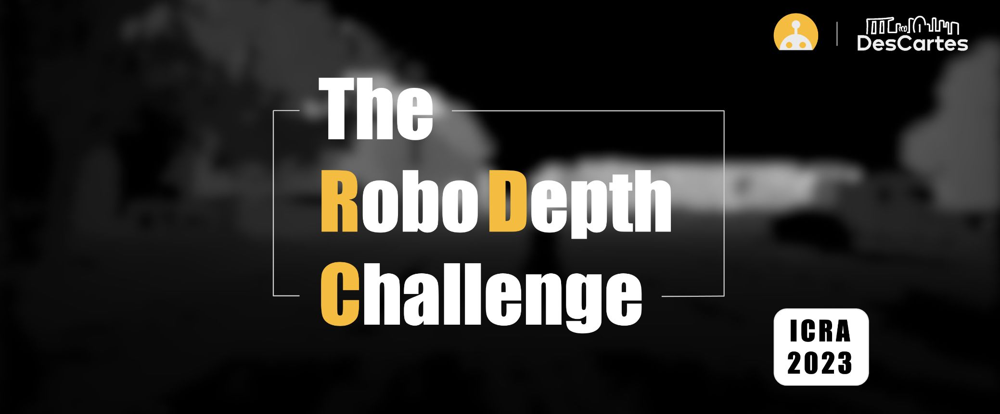

# RoboDepth Competition @ ICRA 2023

Welcome to the [RoboDepth Competition](https://robodepth.github.io/)! :robot:
- This is the **first** challenge on robust depth estimation under corruptions, which is associated with the 40th IEEE Conference on Robotics and Automation ([ICRA 2023](https://link.zhihu.com/?target=https%3A//www.icra2023.org/welcome)).
- In this competition, we target on probing the **Out-of-Distribution (OoD) robustness** of depth estimation models under common corruptions.
- There are **18 different corruption types** in total, ranging from three perspectives: weather and lighting conditions, sensor failure and movement, and data processing issues.
- There are **two tracks** in this competition, including self-supervised depth estimation of outdoor scenes (track 1) and fully-supervised depth estimation of indoor scenes (track 2).

<p align="center">
  
</p>


## Outline
- [Useful Info](#gem-useful-info)
- [Timeline](#clock1-timeline)
- [Data Preparation](#floppy_disk-data-preparation)
- [Submission](#arrow_double_up-submission)
- [Terms & Conditions](#balance_scale-terms--conditions)


## :gem: Useful Info
- :globe_with_meridians: - Competition page: https://robodepth.github.io.
- :wrench: - Competition toolkit: https://github.com/ldkong1205/RoboDepth.
- :oncoming_automobile: - Evaluation server (track 1): https://codalab.lisn.upsaclay.fr/competitions/9418.
- :oncoming_taxi: - Evaluation server (track 2): Coming soon.
- :octocat: - Official GitHub account: https://github.com/RoboDepth.
- :mailbox: - Contact: robodepth@outlook.com.


## :clock1: Timeline
- \[2023.01.01\] - Competition launches
- \[2023.01.02\] - Track 1 (self-supervised depth estimation) starts
- \[2023.01.15\] - Track 2 (fully-supervised depth estimation) starts
- \[2023.05.25\] - Competition ends
- \[2023.05.29\] - Workshop & discussion
- \[2023.06.02\] - Release of results @ ICRA 2023


## :floppy_disk: Data Preparation

### \[Track 1\]: Self-Supervised Depth Estimation

### :hamster: Training Set
> In this track, the participants are expected to adopt the data from the [raw KITTI dataset](http://www.cvlibs.net/datasets/kitti/raw_data.php) for model > training. You can download this dataset by running:
> ```shell
> wget -i splits/kitti_archives_to_download.txt -P kitti_data/
> ```
> Then unzip with:
> ```shell
> cd kitti_data/
> unzip "*.zip"
> cd ..
> ```
> Please note that this dataset weighs about `175GB`, so make sure you have enough space to `unzip` too!

> The **training split** of this dataset is defined in the `splits/` folder of this codebase. By default, we **require** all participants to train their depth estimation models using Zhou's subset of the standard **Eigen split** of KITTI, which is designed for self-supervised monocular training.

> :warning: Regarding the **data augmentation** to be adopted during the training phase, please refer to the [Terms & Conditions](#terms--conditions) section.

### :robot: Evaluation Set
> In this track, the participants are expected to adopt our generated data model evaluation. There are multiple ways of accessing the evaluation set. In particular, you can download the data from Google Drive via the following link:<br>
> :link: https://drive.google.com/file/d/14Z0k2lhpk0D0pkyzIcHyk4Ce0wS3IcfF/view?usp=sharing.

> Alternatively, you can download the data from [this](https://codalab.lisn.upsaclay.fr/competitions/9418#participate-get_starting_kit) CodaLab page. Please note that you need to **register** for this track first before entering the downloading page.

> This evaluation set weighs about `100MB`. It includes **500 corrupted images**, generated under the mentioned 18 corruption types. In this competition, we will evaluate the model performance using the ground-truth depth of these images. The participants are required to submit the prediction file to [this](https://codalab.lisn.upsaclay.fr/competitions/9418) evaluation server. For more details on the submission, please refer to the [Submission](#arrow_double_up-submission) section.

<hr>

### \[Track 2\]: Fully-Supervised Depth Estimation

### :hamster: Training Set
> Coming soon!

### :robot: Evaluation Set
> Coming soon!


## :arrow_double_up: Submission

### \[Track 1\]: Self-Supervised Depth Estimation
> In this track, the participants are expected to submit their predictions to the CodaLab server for model evaluation. Specifically, you can access the server of this track via the following link:<br>
> :link: https://codalab.lisn.upsaclay.fr/competitions/9418.

> In order to make a successful submission and evaluation, you need to follow these instructions:

> **\[Registration\]**<br> You will need to **register for this track** on CodaLab before you can make a submission. To achieve this, apply for a CodaLab account if you do not have one, with your email. Then, go to the server page of this track and press `Participate`; you will see a `Sign In` button. Click it for registration.

> **\[File Preparation\]**<br> You will need to prepare the **model prediction file** for submission. Specifically, the evaluation server of this track accepts the `.zip` file of your model predictions in `numpy array` format. You can follow the example below, which is modified based on the evaluation code from [MonoDepth2](https://arxiv.org/abs/1806.01260):<br>
> - Step 1: Generate your model predictions with: 
>   ```shell
>   with torch.no_grad():
>     for data in dataloader:
>       input_color = data[("color", 0, -1)].to(device)
>       output = depth_decoder(encoder(input_color))
>       pred_disp, _ = disp_to_depth(output[("disp", 0)], opt.min_depth, opt.max_depth)
>       pred_disp = pred_disp.cpu()[:, 0].numpy()
>       pred_disps.append(pred_disp)
>   ```   
> - Step 2: After evaluating every samples in the evaluation set, save the prediction file with:
>   ```shell
>   output_path = os.path.join(opt.save_pred_path, "disp.npy")
>   np.save(output_path, pred_disps)
>   ```
> - Step 3: Compress the saved `.npy` file with:
>   ```shell
>   zip disp.zip disp.npy
>   ```
> - Step 4: Download `disp.zip` from your computing machine.

> **\[Submission & Evaluation\]**<br> You will need to submit your `disp.zip` file manually to the evaluation server. To achieve this, go to the server page of this track and press `Participate`; you will see a `Submit / View Results` button. Click it for submission. You are encouraged to fill in the submission info with your *team name*, *method name*, and *method description*. Then, click the `Submit` button and select your `disp.zip` file. After successfully uploading the file, the server will automatically evaluates the performance of your submission and put the results to the leaderboard.<br>
> :warning: Do not close the page when you are uploading the prediction file.

> **\[View Result\]**<br> You can view your scores by pressing the `Results` button. Following the same configuration with [MonoDepth2](https://arxiv.org/abs/1806.01260), we evaluate the model performance with 7 metrics: `abs_rel`, `sq_rel`, `rmse`, `rmse_log`, `a1`, `a2`, and `a3`.

<hr>

### \[Track 2\]: Fully-Supervised Depth Estimation
> Coming soon!


## :balance_scale: Terms & Conditions
This competition is made freely available to academic and non-academic entities for non-commercial purposes such as academic research, teaching, scientific publications, or personal experimentation. Permission is granted to use the data given that you agree:
1. That the data in this competition comes “AS IS”, without express or implied warranty. Although every effort has been made to ensure accuracy, we do not accept any responsibility for errors or omissions.
2. That you may not use the data in this competition or any derivative work for commercial purposes as, for example, licensing or selling the data, or using the data with a purpose to procure a commercial gain.
3. That you include a reference to RoboDepth (including the benchmark data and the specially generated data for academic challenges) in any work that makes use of the benchmark. For research papers, please cite our preferred publications as listed on our webpage.

To ensure a **fair comparison** among all participants, we require:
1. All participants must follow the **exact same data configuration** when training and evaluating their algorithms. Please do not use any public or private datasets other than those specified for model training.
2. The theme of this competition is to probe the out-of-distribution robustness of depth estimation models. Theorefore, any use of the 18 corruption types designed in this benchmark is **strictly prohibited**, including any atomic operation that is comprising any one of the mentioned corruptions.
3. To ensure the above two rules are followed, each participant is requested to **submit the code** with reproducible results before the final result is announced; the code is for examination purpose only and we will manually verify the training and evaluation of each participant's model.

If you have any question or concern, please contact us at robodepth@outlook.com.
