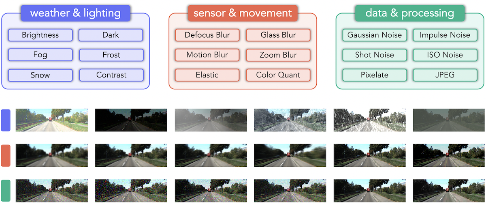

# Create Corruptions

### Outline
- [Build Corruption Sets](#build-corruption-sets)
- [Corruption Taxonomy](#corruption-taxonomy)
- [Dataset Structure](#dataset-structure)
- [Simulation Algorithm](#simulation-algorithm)
  - [Configuration Details](#configuration-details)
  - [Brightness](#brightness)
  - [Dark](#dark)
  - [Fog](#fog)
  - [Frost](#frost)
  - [Snow](#snow)
  - [Contrast](#contrast)
  - [Defocus Blur](#defocus-blur)
  - [Glass Blur](#glass-blur)
  - [Motion Blur](#motion-blur)
  - [Zoom Blur](#zoom-blur)
  - [Elastic Transform](#elastic-transform)
  - [Color Quant](#color-quant)
  - [Gaussian Noise](#gaussian-noise)
  - [Impulse Noise](#impulse-noise)
  - [Shot Noise](#shot-noise)
  - [ISO Noise](#iso-noise)
  - [Pixelate](#pixelate)
  - [JPEG Compression](#jpeg-compression)
- [Acknowledgement](#acknowledgement)


## Build Corruption Sets
To generate `RoboDepth` evaluation benchmarks on custom datasets, go to the `corruptions` folder:
```shell
cd corruptions/
```
Specify the corruption types to be created in an `create.sh` script, for example:
```shell
python3 corruptions/create.py \
    --image_list splits/eigen.txt \
    --H 192 \  # image height
    --W 640 \  # image width
    --save_path kitti_data/kitti_c \
    --if_zoom_blur  # create corruption type "zoom blur"
 ```

Then run `create.sh`:
```shell
sh create.sh
```

## Corruption Taxonomy

Our benchmark suite supports **18** common corruptions. We summarize the corruption types as follows:
- Weather & lighting conditions: `brightness`, `dark`, `fog`, `frost`, `snow`, and `contrast`.
- Sensor & movement: `defocus_blur`, `glass_blur`, `motion_blur`, `zoom_blur`, `elastic`, and `color_quant`.
- Data & processing: `gaussian_noise`, `impulse_noise`, `shot_noise`, `iso_noise`, `pixelate`, and `jpeg`.

 |
|:-:|


## Dataset Structure
Successfully running `create.sh` will create and save images corrupted with the specified corruption types to `kitti_data/kitti_c/`. The dataset structure should end up looking like the following:
```shell
└── RoboDepth 
      │── corruptions
      │    │── create.py
      │    │── create.sh
      │    └── ...
      │── docs
      │── figs
      │── kitti_data
      │    │── 2011_09_26
      │    │── ...
      │    └── kitti_c
      │         │── brightness
      │         │── ...
      │         └── zoom_blur
      │── models
      │── zoo
      └── ...
```


## Simulation Algorithm

### Configuration Details

| Corruption | Parameter | Level 1 | Level 2 | Level 3 | Level 4 | Level 5 | 
|:-:|:-:|:-:|:-:|:-:|:-:|:-:|
| `brightness` | adjustment in HSV space | 0.1 | 0.2 | 0.3 | 0.4 | 0.5 |
| `dark` | scale factor | 0.6 | 0.5 | 0.4 | 0.3 | 0.2 |
| `fog` | (thickness, smoothness) | (1.5, 2.0) | (2.0, 2.0) | (2.5, 1.7) | (2.5, 1.5) | (3.0, 1.4) |
| `frost` | (frost intensity, texture influence) | (1.00, 0.40) | (0.80, 0.60) | (0.70, 0.70) | (0.65, 0.70) | (0.60, 0.75) |
| `snow` | (mean, std, scale, threshold, blur radius, blur std, blending ratio) | (0.1, 0.3, 3.0, 0.5, 10.0, 4.0, 0.8) | (0.2, 0.3, 2, 0.5, 12, 4, 0.7) | (0.55, 0.3, 4, 0.9, 12, 8, 0.7) | (0.55, 0.3, 4.5, 0.85, 12, 8, 0.65) | (0.55, 0.3, 2.5, 0.85, 12, 12, 0.55) |
| `contrast` | adjustment of pixel mean | 0.40 | 0.30 | 0.20 | 0.10 | 0.05 |
| `defocus_blur` | (kernel radius, alias blur) | (3.0, 0.1) | (4.0, 0.5) | (6.0, 0.5) | (8.0, 0.5) | (10.0, 0.5) |
| `glass_blur` | (sigma, max delta, iterations) | (0.7, 1.0, 2.0) | (0.9, 2.0, 1.0) | (1.0, 2.0, 3.0) | (1.1, 3.0, 2.0) | (1.5, 4.0, 2.0) |
| `motion_blur` | (radius, sigma) | (10, 3) | (15, 5) | (15, 8) | (15, 12) | (20, 15) |
| `zoom_blur` | (low, high, step size) | (1.00, 1.11, 0.01) | (1.00, 1.16, 0.01) | (1.00, 1.21, 0.02) | (1.00, 1.26, 0.02) | (1.00, 1.31, 0.03) |
| `elastic_transform` | deformation | 0.050 | 0.065 | 0.085 | 0.100 | 0.120 |
| `color_quant` | bit number | 5 | 4 | 3 | 2 | 1 |
| `gaussian_noise` | noise scale | 0.08 | 0.12 | 0.18 | 0.26 | 0.38 |
| `impulse_noise` | noise amount | 0.03 | 0.06 | 0.09 | 0.17 | 0.27 |
| `shot_noise` | photon number | 60 | 25 | 12 | 5 | 3 |
| `iso_noise` | noise scale | 0.08 | 0.12 | 0.18 | 0.26 | 0.38 |
| `pixelate` | resize factor | 0.60 | 0.50 | 0.40 | 0.30 | 0.25 |
| `jpeg_compression` | compression quality | 25 | 18 | 15 | 10 | 7 |

### Brightness
The `brightness` function alters the HSV (Hue, Saturation, Value) color space of an image, adjusting the brightness component. Specifically, it simulates brightness changes by adding or subtracting an adjustment coefficient, resulting in an overall brightening or darkening effect on the image.

```python
def brightness(x, severity=1):
    c = [.1, .2, .3, .4, .5][severity - 1]

    x = np.array(x) / 255.

    if len(x.shape) < 3 or x.shape[2] < 3:
        x = np.clip(x + c, 0, 1)
    else:
        x = sk.color.rgb2hsv(x)
        x[:, :, 2] = np.clip(x[:, :, 2] + c, 0, 1)
        x = sk.color.hsv2rgb(x)

    return np.clip(x, 0, 1) * 255
```

### Dark
The `dark` function simulates the appearance of images taken in low-light conditions. It reduces the overall brightness of the image and introduces noise to mimic the challenges of capturing images in low-light environments.

```python
def dark(x, severity):
    c = [0.60, 0.50, 0.40, 0.30, 0.20][severity-1]
    x = np.array(x) / 255.
    x_scaled = imadjust(x, x.min(), x.max(), 0, c, gamma=2.) * 255
    x_scaled = poisson_gaussian_noise(x_scaled, severity=severity-1)

    return x_scaled
```

### Fog
The `fog` function applies a simulated fog effect to an image by adding a foggy texture generated through plasma fractals. The fog effect is controlled by parameters that determine the thickness and smoothness, creating a visual distortion resembling the appearance of fog.

```python
def fog(x, severity=1):
    c = [(1.5, 2), (2., 2), (2.5, 1.7), (2.5, 1.5), (3., 1.4)][severity - 1]

    shape = np.array(x).shape
    max_side = np.max(shape)
    map_size = next_power_of_2(int(max_side))

    x = np.array(x) / 255.
    max_val = x.max()
    x_shape = np.array(x).shape
    if len(x_shape) < 3 or x_shape[2] < 3:
        x += c[0] * plasma_fractal(mapsize=map_size, wibbledecay=c[1])[:shape[0], :shape[1]]
    else:
        x += c[0] * plasma_fractal(mapsize=map_size, wibbledecay=c[1])[:shape[0], :shape[1]][..., np.newaxis]

    return np.clip(x * max_val / (max_val + c[0]), 0, 1) * 255
```

### Frost
The `frost` function applies a simulated frost effect to an image by overlaying frost textures obtained from pre-defined frost images. The frost effect introduces icy patterns to the image, creating the appearance of frost accumulation.

```python
def frost(x, severity=1):
    c = [(1, 0.4), (0.8, 0.6), (0.7, 0.7), (0.65, 0.7), (0.6, 0.75)][severity - 1]

    idx = np.random.randint(5)
    filename = [resource_filename(__name__, './frost/frost1.png'), resource_filename(__name__, './frost/frost2.png'), resource_filename(__name__, './frost/frost3.png'), resource_filename(__name__, './frost/frost4.jpg'), resource_filename(__name__, './frost/frost5.jpg'), resource_filename(__name__, './frost/frost6.jpg')][idx]
    frost = cv2.imread(filename)
    frost_shape = frost.shape
    x_shape = np.array(x).shape

    scaling_factor = 1
    if frost_shape[0] >= x_shape[0] and frost_shape[1] >= x_shape[1]:
        scaling_factor = 1
    elif frost_shape[0] < x_shape[0] and frost_shape[1] >= x_shape[1]:
        scaling_factor = x_shape[0] / frost_shape[0]
    elif frost_shape[0] >= x_shape[0] and frost_shape[1] < x_shape[1]:
        scaling_factor = x_shape[1] / frost_shape[1]
    elif frost_shape[0] < x_shape[0] and frost_shape[1] < x_shape[1]:
        scaling_factor_0 = x_shape[0] / frost_shape[0]
        scaling_factor_1 = x_shape[1] / frost_shape[1]
        scaling_factor = np.maximum(scaling_factor_0, scaling_factor_1)

    scaling_factor *= 1.1
    new_shape = (int(np.ceil(frost_shape[1] * scaling_factor)), int(np.ceil(frost_shape[0] * scaling_factor)))
    frost_rescaled = cv2.resize(frost, dsize=new_shape, interpolation=cv2.INTER_CUBIC)
    x_start, y_start = np.random.randint(0, frost_rescaled.shape[0] - x_shape[0]), np.random.randint(0, frost_rescaled.shape[1] - x_shape[1])

    if len(x_shape) < 3 or x_shape[2] < 3:
        frost_rescaled = frost_rescaled[x_start:x_start + x_shape[0], y_start:y_start + x_shape[1]]
        frost_rescaled = rgb2gray(frost_rescaled)
    else:
        frost_rescaled = frost_rescaled[x_start:x_start + x_shape[0], y_start:y_start + x_shape[1]][..., [2, 1, 0]]

    return np.clip(c[0] * np.array(x) + c[1] * frost_rescaled, 0, 255)
```

### Snow
The `snow` function simulates a snow effect on an image by generating a layer of snow-like particles and adding motion blur to create the appearance of falling snowflakes. The snow particles are combined with the input image, introducing a snowy ambiance.

```python
def snow(x, severity=1):
    c = [(0.1, 0.3, 3, 0.5, 10, 4, 0.8), (0.2, 0.3, 2, 0.5, 12, 4, 0.7), (0.55, 0.3, 4, 0.9, 12, 8, 0.7), (0.55, 0.3, 4.5, 0.85, 12, 8, 0.65), (0.55, 0.3, 2.5, 0.85, 12, 12, 0.55)][severity - 1]

    x = np.array(x, dtype=np.float32) / 255.
    snow_layer = np.random.normal(size=x.shape[:2], loc=c[0], scale=c[1])

    snow_layer = clipped_zoom(snow_layer[..., np.newaxis], c[2])
    snow_layer[snow_layer < c[3]] = 0

    snow_layer = np.clip(snow_layer.squeeze(), 0, 1)
    snow_layer = _motion_blur(snow_layer, radius=c[4], sigma=c[5], angle=np.random.uniform(-135, -45))
    snow_layer = np.round(snow_layer * 255).astype(np.uint8) / 255.
    snow_layer = snow_layer[..., np.newaxis]
    snow_layer = snow_layer[:x.shape[0], :x.shape[1], :]

    if len(x.shape) < 3 or x.shape[2] < 3:
        x = c[6] * x + (1 - c[6]) * np.maximum(x, x.reshape(x.shape[0], x.shape[1]) * 1.5 + 0.5)
        snow_layer = snow_layer.squeeze(-1)
    else:
        x = c[6] * x + (1 - c[6]) * np.maximum(x, cv2.cvtColor(x, cv2.COLOR_RGB2GRAY).reshape(x.shape[0], x.shape[1], 1) * 1.5 + 0.5)
    try:
        return np.clip(x + snow_layer + np.rot90(snow_layer, k=2), 0, 1) * 255
    except ValueError:
        print('ValueError for Snow, Exception handling')
        x[:snow_layer.shape[0], :snow_layer.shape[1]] += snow_layer + np.rot90(snow_layer, k=2)
            
        return np.clip(x, 0, 1) * 255
```

### Contrast
The `contrast` function modifies the contrast of an image by adjusting pixel values around their mean. The degree of adjustment is controlled by a parameter, resulting in enhanced or reduced contrast.

```python
def contrast(x, severity=1):
    c = [0.4, .3, .2, .1, .05][severity - 1]

    x = np.array(x) / 255.
    means = np.mean(x, axis=(0, 1), keepdims=True)

    return np.clip((x - means) * c + means, 0, 1) * 255
```

### Defocus Blur
The `defocus_blur` function applies a defocus blur effect to an image, simulating the appearance of an out-of-focus photograph. This is achieved by convolving the image with a circular disk-shaped kernel.

```python
def defocus_blur(x, severity=1):
    c = [(3, 0.1), (4, 0.5), (6, 0.5), (8, 0.5), (10, 0.5)][severity - 1]

    x = np.array(x) / 255.
    kernel = disk(radius=c[0], alias_blur=c[1])

    channels = []
    if len(x.shape) < 3 or x.shape[2] < 3:
        channels = np.array(cv2.filter2D(x, -1, kernel))
    else:
        for d in range(3):
            channels.append(cv2.filter2D(x[:, :, d], -1, kernel))
        channels = np.array(channels).transpose((1, 2, 0))

    return np.clip(channels, 0, 1) * 255
```

### Glass Blur
The `glass_blur` function applies a glass blur effect to an image, simulating the distortion caused by viewing an image through a frosted glass surface. This effect is achieved by locally shuffling pixels and applying Gaussian blurring.

```python
def glass_blur(x, severity=1):
    c = [(0.7, 1, 2), (0.9, 2, 1), (1, 2, 3), (1.1, 3, 2), (1.5, 4, 2)][severity - 1]

    x = np.uint8(gaussian(np.array(x) / 255., sigma=c[0], multichannel=True) * 255)
    x_shape = np.array(x).shape

    for i in range(c[2]):
        for h in range(x_shape[0] - c[1], c[1], -1):
            for w in range(x_shape[1] - c[1], c[1], -1):
                dx, dy = np.random.randint(-c[1], c[1], size=(2,))
                h_prime, w_prime = h + dy, w + dx
                x[h, w], x[h_prime, w_prime] = x[h_prime, w_prime], x[h, w]

    return np.clip(gaussian(x / 255., sigma=c[0], multichannel=True), 0, 1) * 255
 ```                  

### Motion Blur
The `motion_blur` function simulates a motion blur effect in an image by applying a blurring kernel that represents the motion of a camera or object during exposure. This creates the illusion of movement or motion streaks.

```python
def motion_blur(x, severity=1):
    shape = np.array(x).shape
    c = [(10, 3), (15, 5), (15, 8), (15, 12), (20, 15)][severity - 1]
    x = np.array(x)

    angle = np.random.uniform(-45, 45)
    x = _motion_blur(x, radius=c[0], sigma=c[1], angle=angle)

    if len(x.shape) < 3 or x.shape[2] < 3:
        gray = np.clip(np.array(x).transpose((0, 1)), 0, 255)
        if len(shape) >= 3 or shape[2] >=3:
            return np.stack([gray, gray, gray], axis=2)
        else:
            return gray
    else:
        return np.clip(x, 0, 255)
```

### Zoom Blur
The `zoom_blur` function simulates a zoom blur effect in an image by applying a series of zoomed and cropped layers with varying zoom factors. These layers are then combined to create the illusion of zooming or rushing effect toward the center of the image.

```python
def zoom_blur(x, severity=1):
    c = [np.arange(1, 1.11, 0.01), np.arange(1, 1.16, 0.01), np.arange(1, 1.21, 0.02), np.arange(1, 1.26, 0.02), np.arange(1, 1.31, 0.03)][severity - 1]

    x = (np.array(x) / 255.).astype(np.float32)
    out = np.zeros_like(x)

    set_exception = False
    for zoom_factor in c:
        if len(x.shape) < 3 or x.shape[2] < 3:
            x_channels = np.array([x, x, x]).transpose((1, 2, 0))
            zoom_layer = clipped_zoom(x_channels, zoom_factor)
            zoom_layer = zoom_layer[:x.shape[0], :x.shape[1], 0]
        else:
            zoom_layer = clipped_zoom(x, zoom_factor)
            zoom_layer = zoom_layer[:x.shape[0], :x.shape[1], :]
        try:
            out += zoom_layer
        except ValueError:
            set_exception = True
            out[:zoom_layer.shape[0], :zoom_layer.shape[1]] += zoom_layer

    if set_exception:
        print('ValueError for zoom blur, Exception handling')
    x = (x + out) / (len(c) + 1)
    
    return np.clip(x, 0, 1) * 255
```

### Elastic Transform
The `elastic_transform` function simulates elastic distortions in an image, mimicking the deformation of objects under stress or tension. It uses a combination of random displacement fields and interpolation to create the distortion effect.

```python
def elastic_transform(image, severity=1):
    image = np.array(image, dtype=np.float32) / 255.
    shape = image.shape
    shape_size = shape[:2]
    sigma = np.array(shape_size) * 0.01
    alpha = [250 * 0.05, 250 * 0.065, 250 * 0.085, 250 * 0.1, 250 * 0.12][severity - 1]
    max_dx = shape[0] * 0.005
    max_dy = shape[0] * 0.005

    dx = (gaussian(np.random.uniform(-max_dx, max_dx, size=shape[:2]), sigma, mode='reflect', truncate=3) * alpha).astype(np.float32)
    dy = (gaussian(np.random.uniform(-max_dy, max_dy, size=shape[:2]), sigma, mode='reflect', truncate=3) * alpha).astype(np.float32)

    if len(image.shape) < 3 or image.shape[2] < 3:
        x, y = np.meshgrid(np.arange(shape[1]), np.arange(shape[0]))
        indices = np.reshape(y + dy, (-1, 1)), np.reshape(x + dx, (-1, 1))
    else:
        dx, dy = dx[..., np.newaxis], dy[..., np.newaxis]
        x, y, z = np.meshgrid(np.arange(shape[1]), np.arange(shape[0]), np.arange(shape[2]))
        indices = np.reshape(y + dy, (-1, 1)), np.reshape(x + dx, (-1, 1)), np.reshape(z, (-1, 1))

    return np.clip(map_coordinates(image, indices, order=1, mode='reflect').reshape(shape), 0, 1) * 255
```

### Color Quant
The `color_quant` function applies color quantization to an image, reducing the number of distinct colors present in the image. This process can lead to a more posterized or stylized appearance, where colors are grouped into a smaller palette.

```python
def color_quant(x, severity):
    bits = 5 - severity + 1
    x = PIL.ImageOps.posterize(x, bits)

    return x
```

### Gaussian Noise
The `gaussian_noise` function adds Gaussian noise to an image, introducing random fluctuations in pixel values. This simulates the effect of noise in a photographic or digital image.

```python
def gaussian_noise(x, severity=1):
    c = [0.08, 0.12, 0.18, 0.26, 0.38][severity - 1]
    x = np.array(x) / 255.

    return np.clip(x + np.random.normal(size=x.shape, scale=c), 0, 1) * 255
```

### Impulse Noise
The `impulse_noise` function adds impulse noise (also known as salt-and-pepper noise) to an image, introducing randomly occurring white and black pixels that resemble salt and pepper grains.

```python
def impulse_noise(x, severity=1):
    c = [0.03, 0.06, 0.09, 0.17, 0.27][severity - 1]
    x = sk.util.random_noise(np.array(x) / 255., mode='s&p', amount=c)

    return np.clip(x, 0, 1) * 255
```

### Shot Noise
The `shot_noise` function simulates shot noise, which is a type of noise that occurs due to the discrete nature of light particles (photons) hitting a sensor during image capture. This noise appears as random variations in pixel intensity.

```python
def shot_noise(x, severity=1):
    c = [60, 25, 12, 5, 3][severity - 1]
    x = np.array(x) / 255.

    return np.clip(np.random.poisson(x * c) / float(c), 0, 1) * 255
```

### ISO Noise
The `iso_noise` function simulates the noise that can be introduced in images due to higher ISO settings in photography. It combines Poisson noise and Gaussian noise to replicate the characteristics of ISO noise.

```python
def iso_noise(x, severity):
    c_poisson = 25
    x = np.array(x) / 255.
    x = np.clip(np.random.poisson(x * c_poisson) / c_poisson, 0, 1) * 255.
    c_gauss = 0.7 * [0.08, 0.12, 0.18, 0.26, 0.38][severity-1]
    x = np.array(x) / 255.
    x = np.clip(x + np.random.normal(size=x.shape, scale= c_gauss), 0, 1) * 255.

    return Image.fromarray(np.uint8(x))
```

### Pixelate
The `pixelate` function applies a pixelation effect to an image, reducing the image resolution by creating larger blocks of pixels. This results in a mosaic-like appearance where image details are simplified.

```python
def pixelate(x, severity=1):
    c = [0.6, 0.5, 0.4, 0.3, 0.25][severity - 1]
    x_shape = np.array(x).shape
    x = x.resize((int(x_shape[1] * c), int(x_shape[0] * c)), Image.BOX)
    x = x.resize((x_shape[1], x_shape[0]), Image.NEAREST)

    return x
```

### JPEG Compression
The `jpeg_compression` function applies JPEG compression to an image, which involves encoding the image in a lossy format. This process reduces the file size by discarding some image details while attempting to maintain visual quality.

```python
def jpeg_compression(x, severity=1):
    c = [25, 18, 15, 10, 7][severity - 1]

    output = BytesIO()
    gray_scale = False
    if x.mode != 'RGB':
        gray_scale = True
        x = x.convert('RGB')
    x.save(output, 'JPEG', quality=c)
    x = Image.open(output)
    if gray_scale:
        x = x.convert('L')

    return x
```


## Acknowledgement
We acknowledge the use of the following public resources, during the course of this work:
- `ImageCorruptions`: https://github.com/bethgelab/imagecorruptions
- `3DCC`: https://github.com/EPFL-VILAB/3DCommonCorruptions
- `ImageNet-C`: https://github.com/hendrycks/robustness

