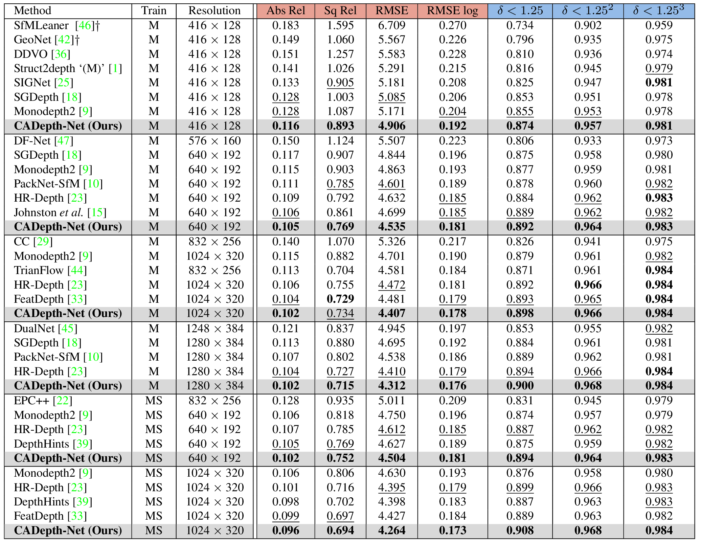
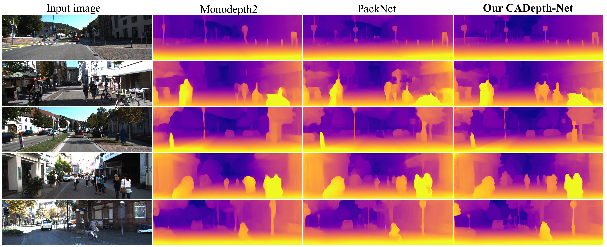

# Channel-Wise Attention-Based Network for Self-Supervised Monocular Depth Estimation

This is the official implementation for the method described in

> Channel-Wise Attention-Based Network for Self-Supervised Monocular Depth Estimation
>
> Jiaxing Yan, Hong Zhao, Penghui Bu and YuSheng Jin. 
>
> [3DV 2021 (arXiv pdf)](https://arxiv.org/abs/2112.13047)





# Setup

Assuming a fresh [Anaconda](https://www.anaconda.com/download/) distribution, you can install the dependencies with:

```shell
conda install pytorch=1.7.0 torchvision=0.8.1 -c pytorch
pip install tensorboardX==2.1
pip install opencv-python==3.4.7.28
pip install albumentations==0.5.2   # we use albumentations for faster image preprocessing
```

This project uses Python 3.7.8, cuda 11.4, the experiments were conducted using a single NVIDIA RTX 3090 GPU and CPU environment - Intel Core i9-9900KF. 

We recommend using a [conda environment](https://conda.io/docs/user-guide/tasks/manage-environments.html) to avoid dependency conflicts.

# Prediction for a single image

You can predict scaled disparity for a single image with:

```shell
python test_simple.py --image_path images/test_image.jpg --model_name MS_1024x320
```

On its first run either of these commands will download the `MS_1024x320` pretrained model (272MB) into the `models/` folder.
We provide the following  options for `--model_name`:

| `--model_name`                                               | Training modality | Resolution | Abs_Rel | Sq_Rel | $\delta<1.25$ |
| ------------------------------------------------------------ | ----------------- | ---------- | ------- | ------ | ------------- |
| [`M_640x192`](https://drive.google.com/file/d/1-Xh_2AUw7fYSJ7Pqq89KdDSZYipv1TJ_/view?usp=sharing) | Mono              | 640 x 192  | 0.105   | 0.769  | 0.892         |
| [`M_1024x320`](https://drive.google.com/file/d/100m6JHvxEcsCmHhZkQw8_wW8KXqiPSfp/view?usp=sharing) | Mono              | 1024 x 320 | 0.102   | 0.734  | 0.898         |
| [`M_1280x384`](https://drive.google.com/file/d/103AxkDKBnwrmizjJma7mUriUrMn94Tyv/view?usp=sharing) | Mono              | 1280 x 384 | 0.102   | 0.715  | 0.900         |
| [`MS_640x192`](https://drive.google.com/file/d/105dwrsDkeZxADsX4KLEv3wrMjzM_I-D_/view?usp=sharing) | Mono + Stereo     | 640 x 192  | 0.102   | 0.752  | 0.894         |
| [`MS_1024x320`](https://drive.google.com/file/d/10ErVRtaQF7x1wlsYqNaqYxZOVhG7-GWM/view?usp=sharing) | Mono + Stereo     | 1024 x 320 | 0.096   | 0.694  | 0.908         |

# KITTI training data

You can download the entire [raw KITTI dataset](http://www.cvlibs.net/datasets/kitti/raw_data.php) by running:

```shell
wget -i splits/kitti_archives_to_download.txt -P kitti_data/
```

Then unzip with

```shell
cd kitti_data
unzip "*.zip"
cd ..
```

**Splits**

The train/test/validation splits are defined in the `splits/` folder.
By default, the code will train a depth model using [Zhou's subset](https://github.com/tinghuiz/SfMLearner) of the standard Eigen split of KITTI, which is designed for monocular training.
You can also train a model using the new [benchmark split](http://www.cvlibs.net/datasets/kitti/eval_depth.php?benchmark=depth_prediction) or the [odometry split](http://www.cvlibs.net/datasets/kitti/eval_odometry.php) by setting the `--split` flag.

# Training

**Monocular training:**

```shell
python train.py --model_name mono_model
```

**Stereo training:**

Our code defaults to using Zhou's subsampled Eigen training data. For stereo-only training we have to specify that we want to use the full Eigen training set.

```shell
python train.py --model_name stereo_model \
  --frame_ids 0 --use_stereo --split eigen_full
```

**Monocular + stereo training:**

```shell
python train.py --model_name mono+stereo_model \
  --frame_ids 0 -1 1 --use_stereo
```

**Note**: For high resolution input, e.g. 1024x320 and 1280x384, we employ a lightweight setup, ResNet18 and 640x192, for pose encoder at training for memory savings. The following example command trains a model named `M_1024x320`:

```shell
python train.py --model_name M_1024x320 --num_layers 50 --height 320 --width 1024 --num_layers_pose 18 --height_pose 192 --width_pose 640
#             encoder     resolution                                     
# DepthNet   resnet50      1024x320
# PoseNet    resnet18       640x192
```

## Finetuning a pretrained model

Add the following to the training command to load an existing model for finetuning:

```shell
python train.py --model_name finetuned_mono --load_weights_folder ~/tmp/mono_model/models/weights_19
```

## Other training options

Run `python train.py -h` (or look at `options.py`) to see the range of other training options, such as learning rates and ablation settings.

# KITTI evaluation

To prepare the ground truth depth maps run:

```shell
python export_gt_depth.py --data_path kitti_data --split eigen
python export_gt_depth.py --data_path kitti_data --split eigen_benchmark
```

...assuming that you have placed the KITTI dataset in the default location of `./kitti_data/`.

The following example command evaluates the weights of a model named `MS_1024x320`:

```shell
python evaluate_depth.py --load_weights_folder ./log/MS_1024x320 --eval_mono --data_path ./kitti_data --eval_split eigen
```

## Precomputed results

You can download our precomputed disparity predictions from the following links:

| Training modality | Input size | `.npy` filesize | Eigen disparities                                            |
| ----------------- | ---------- | --------------- | ------------------------------------------------------------ |
| Mono              | 640 x 192  | 326M            | [Download 🔗](https://drive.google.com/file/d/1-vk6Xl_YLpkJrjVNe6_lK_uFhe5jTE3-/view?usp=sharing) |
| Mono              | 1024 x 320 | 871M            | [Download 🔗](https://drive.google.com/file/d/102Fh2036ZctMnuIBxKwgyl1TQo8W_FSl/view?usp=sharing) |
| Mono              | 1280 x 384 | 1.27G           | [Download 🔗](https://drive.google.com/file/d/103v-8xbLTyTH7GY-cQspSo7U6sWBD7pf/view?usp=sharing) |
| Mono + Stereo     | 640 x 192  | 326M            | [Download 🔗](https://drive.google.com/file/d/106tKVF1fYzfnzgqErl5aUfUSNmjAWTN1/view?usp=sharing) |
| Mono + Stereo     | 1024 x 320 | 871M            | [Download 🔗](https://drive.google.com/file/d/10FuvQl0Rxif1J9upWRLuy3gAmDYy4Uvz/view?usp=sharing) |

# References

Monodepth2 - https://github.com/nianticlabs/monodepth2
