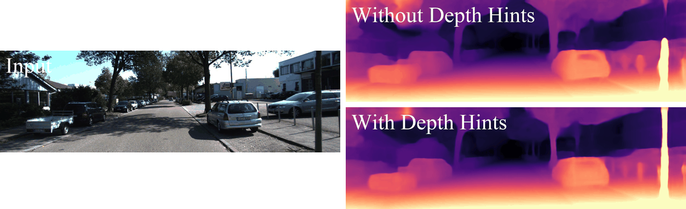
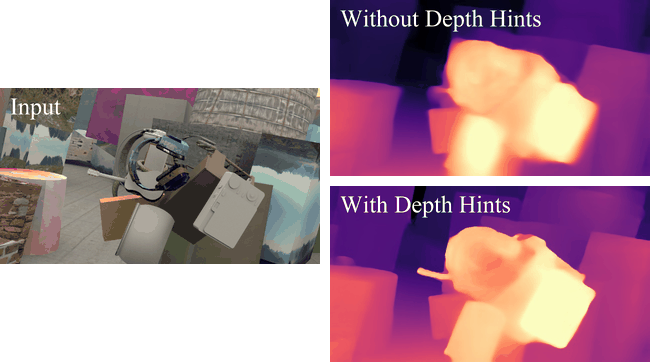

# Self-Supervised Monocular Depth Hints


**[Jamie Watson](https://scholar.google.com/citations?view_op=list_works&hl=en&user=5pC7fw8AAAAJ), [Michael Firman](http://www.michaelfirman.co.uk), [Gabriel J. Brostow](http://www0.cs.ucl.ac.uk/staff/g.brostow/) and [Daniyar Turmukhambetov](http://dantkz.github.io/) – ICCV 2019**

[[Link to paper]](https://arxiv.org/abs/1909.09051)

<p align="center">
  
</p>

**We introduce *Depth Hints*, which improve monocular depth estimation algorithms trained from stereo pairs.**

We find that photometric reprojection losses used with self-supervised learning typically have multiple local minima.   
This can restrict what a regression network learns, for example causing artifacts around thin structures.

**Depth Hints are complementary depth suggestions obtained from simple off-the-shelf stereo algorithms**, e.g. Semi-Global Matching.
These hints are used during training to guide the network to learn better weights.
They require no additional data, and are assumed to be right only sometimes.

Combined with other good practices, Depth Hints gives **state-of-the-art depth predictions on the KITTI benchmark** (see images above and results table below).
We show additional monocular depth estimation results on the [sceneflow dataset](https://lmb.informatik.uni-freiburg.de/resources/datasets/SceneFlowDatasets.en.html):

<p align="center">
  
</p>

## ✏️ 📄 Citation


If you find our work useful or interesting, please consider citing [our paper](https://arxiv.org/abs/1909.09051):

```
@inproceedings{watson-2019-depth-hints,
  title     = {Self-Supervised Monocular Depth Hints},
  author    = {Jamie Watson and
               Michael Firman and
               Gabriel J. Brostow and
               Daniyar Turmukhambetov},
  booktitle = {The International Conference on Computer Vision (ICCV)},
  month = {October},
  year = {2019}
}
```


## 📈 KITTI Results

| Model name | Training modality | ImageNet pretrained | Resolution | Abs rel | Sq rel | 𝛿 < 1.25 |
| ---------- | ---------- | ---------- | ---------- | ---------- | ---------- | ----- |
| `Ours Resnet50` | Stereo | Yes | 640 x 192 | 0.102 | 0.762 | 0.880 | 
| `Ours Resnet50 no pt` | Stereo | No | 640 x 192 | 0.118 | 0.941 | 0.850 |
| `Ours HR Resnet50` | Stereo | Yes | 1024 x 320 | 0.096 | 0.710 | 0.890 |
| `Ours HR Resnet50 no pt` | Stereo | No | 1024 x 320 | 0.112 | 0.857 | 0.861 |
| `Ours HR` | Mono + Stereo | Yes | 1024 x 320 | 0.098 | 0.702 | 0.887 |

Please see the paper for full results. To download the weights and predictions for each model please follow the links below:

| Model name | Training modality | ImageNet pretrained | Resolution | Weights | Eigen Predictions | 
| ---------- | ---------- | ---------- | ---------- | ---------- | ---------- |
| `Ours Resnet50` | Stereo | Yes | 640 x 192 | [Download](https://storage.googleapis.com/niantic-lon-static/research/depth-hints/DH-Resnet50/models.zip) | [Download](https://storage.googleapis.com/niantic-lon-static/research/depth-hints/DH-Resnet50/disps_eigen_split.npy) |
| `Ours Resnet50 no pt` | Stereo | No | 640 x 192 | [Download](https://storage.googleapis.com/niantic-lon-static/research/depth-hints/DH-Resnet50-nopt/models.zip)| [Download](https://storage.googleapis.com/niantic-lon-static/research/depth-hints/DH-Resnet50-nopt/disps_eigen_split.npy) | 
| `Ours HR Resnet50` | Stereo | Yes | 1024 x 320 | [Download](https://storage.googleapis.com/niantic-lon-static/research/depth-hints/DH-HR-Resnet50/models.zip) | [Download](https://storage.googleapis.com/niantic-lon-static/research/depth-hints/DH-HR-Resnet50/disps_eigen_split.npy) | 
| `Ours HR Resnet50 no pt` | Stereo | No | 1024 x 320 | [Download](https://storage.googleapis.com/niantic-lon-static/research/depth-hints/DH-HR-Resnet50-nopt/models.zip) | [Download](https://storage.googleapis.com/niantic-lon-static/research/depth-hints/DH-HR-Resnet50-nopt/disps_eigen_split.npy) |
| `Ours HR` | Mono + Stereo | Yes | 1024 x 320 | [Download](https://storage.googleapis.com/niantic-lon-static/research/depth-hints/DH-HR-Mono%2BStereo/models.zip) | [Download](https://storage.googleapis.com/niantic-lon-static/research/depth-hints/DH-HR-Mono%2BStereo/disps_eigen_split.npy) |


## ⚙️ Code

The code for ***Depth Hints*** builds upon [monodepth2](https://github.com/nianticlabs/monodepth2). If you have questions about running the code, please see the issues in that repository first.

To train using depth hints:
  - Clone this repository
  - Run `python precompute_depth_hints.py  --data_path <your_KITTI_path>`, optionally setting `--save_path` (will default to <data_path>/depth_hints) and `--filenames` (will default to training and validation images for the eigen split). This will create the "fused" depth hints referenced in the paper. This process takes approximately 4 hours on a GPU.
  - Add the flag `--use_depth_hints` to your usual monodepth2 training command, optionally also setting `--depth_hint_path` (will default to <data_path>/depth_hints). See below for a full command.
  
🎉 And that's it! 🎉

## 👀 Reproducing Paper Results

To recreate the results from our paper, run:

```
python train.py
  --data_path <your_KITTI_path>
  --log_dir <your_save_path>
  --model_name stereo_depth_hints
  --use_depth_hints
  --depth_hint_path <your_depth_hint_path>
  --frame_ids 0  --use_stereo
  --scheduler_step_size 5
  --split eigen_full
  --disparity_smoothness 0
```

Additionally:
  - For Resnet50 models, add `--num_layers 50`
  - Add `--height 320  --width 1024` for High Resolution models (you may also have to set `--batch_size 6` depending on the size of your GPU) 
  - For Mono + Stereo add `--frame_ids 0 -1 1 ` and remove `--split eigen_full`

The results above and in the main paper arise from evaluating on the KITTI sparse LiDAR point cloud, using the Eigen Test split.

To test on KITTI, run:

```
python evaluate_depth.py
  --data_path <your_KITTI_path>
  --load_weights_folder <your_model_path>
  --use_stereo
```

Make sure you have run `export_gt_depth.py` to extract ground truth files. 

Additionally, if you see `ValueError: Object arrays cannot be loaded when allow_pickle=False`, then either downgrade numpy, or change line 166 in `evaluate_depth.py` to

```
gt_depths = np.load(gt_path, fix_imports=True, encoding='latin1', allow_pickle=True)["data"]
```

## 🖼 Running on your own images

To run on your own images, run:

```
python test_simple.py
  --image_path <your_image_path>
  --model_path <your_model_path>
  --num_layers <18 or 50>
```

This will save a numpy array of depths, and a colormapped depth image.

## 👩‍⚖️ License
Copyright © Niantic, Inc. 2020. Patent Pending.
All rights reserved.
Please see the [license file](LICENSE) for terms.
