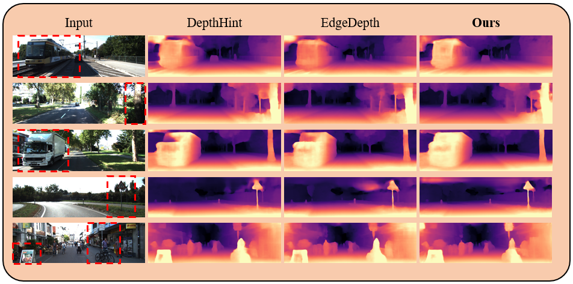

# EPCDepth
EPCDepth is a self-supervised monocular depth estimation model, whose supervision is coming from the other image in a stereo pair. Details are described in our paper:
> Excavating the Potential Capacity of Self-Supervised Monocular Depth Estimation
>
> Rui Peng, Ronggang Wang, Yawen Lai, Luyang Tang, Yangang Cai
>
> ICCV 2021 ([arxiv](https://arxiv.org/abs/2109.12484))

<p align="center">
    
</p>

EPCDepth can produce the most accurate and sharpest result. In the last example, the depth of the person in the second red box should be greater than that of the road sign because the road sign obscures the person. Only our model accurately captures the cue of occlusion.

## ⚙ Setup
#### 1. Recommended environment
- PyTorch 1.1
- Python 3.6
    
#### 2. KITTI data

You can download the raw KITTI dataset (about 175GB) by running:
```
wget -i dataset/kitti_archives_to_download.txt -P <your kitti path>/
cd <your kitti path>
unzip "*.zip"
```
Then, we recommend that you converted the png images to jpeg with this command:
```
find <your kitti path>/ -name '*.png' | parallel 'convert -quality 92 -sampling-factor 2x2,1x1,1x1 {.}.png {.}.jpg && rm {}'
```
or you can skip this conversion step and by manually adjusting the suffix of the image from `.jpg` to `.png` in `dataset/kitti_dataset.py`. Our pre-trained model is trained in jpg, and the test performance on png will slightly decrease.

#### 3. Prepare depth hint

Once you have downloaded the KITTI dataset as in the previous step, you need to prepare the depth hint by running:
```
python precompute_depth_hints.py --data_path <your kitti path>
```
the generated depth hint will be saved to `<your kitti path>/depth_hints`. You should also pay attention to the suffix of the image.

## 📊 Evaluation
#### 1. Download models
Download our pretrained model and put it to `<your model path>`.
<table align="center">
  	<tr align="center">
  	    <td>Pre-trained</td>
		<td>PP</td>
		<td>HxW</td>
		<td>Backbone</td>
		<td>Output Scale</td>
		<td>Abs Rel</td>
		<td>Sq Rel</td>
		<td>RMSE</td>
		<td>δ < 1.25</td>
	</tr>
	<tr align="center">
	    <td rowspan="2"><a href="https://drive.google.com/file/d/1Z60MI_UdTHfoSFSFwLI39yfe8njEN6Kp/view?usp=sharing">model18_lr</a></td>
		<td rowspan="2">√</td>
		<td rowspan="2">192x640</td>
		<td rowspan="2">resnet18 (pt)</td>
		<td>d0</td>
		<td>0.0998</td>
		<td>0.722</td>
		<td>4.475</td>
		<td>0.888</td>
	</tr>
	<tr align="center">
	    <td>d2</td>
		<td>0.1</td>
		<td>0.712</td>
		<td>4.462</td>
		<td>0.886</td>
	</tr>
	<tr align="center">
	    <td rowspan="2"><a href="https://drive.google.com/file/d/1bYnJl8ZG_75cHBpC9jHdfh7vPl8qOGI2/view?usp=sharing">model18</a></td>
		<td rowspan="2">√</td>
		<td rowspan="2">320x1024</td>
		<td rowspan="2">resnet18 (pt)</td>
		<td>d0</td>
		<td>0.0925</td>
		<td>0.671</td>
		<td>4.297</td>
		<td>0.899</td>
	</tr>
	<tr align="center">
	    <td>d2</td>
		<td>0.0920</td>
		<td>0.655</td>
		<td>4.268</td>
		<td>0.898</td>
	</tr>
	<tr align="center">
	    <td rowspan="2"><a href="https://drive.google.com/file/d/17lclC6xSbLdKAKnxUYW7mGUShpQ16dlG/view?usp=sharing">model50</a></td>
		<td rowspan="2">√</td>
		<td rowspan="2">320x1024</td>
		<td rowspan="2">resnet50 (pt)</td>
		<td>d0</td>
		<td>0.0905</td>
		<td>0.646</td>
		<td>4.207</td>
		<td>0.901</td>
	</tr>
	<tr align="center">
	    <td>d2</td>
		<td>0.0905</td>
		<td>0.629</td>
		<td>4.187</td>
		<td>0.900</td>
	</tr>
</table>

**Note:** `pt` refers to pre-trained on ImageNet, and the results of low resolution are a bit different from the paper.

#### 2. KITTI evaluation
    
This operation will save the estimated disparity map to `<your disparity save path>`. To recreate the results from our paper, run:
```
python main.py 
    --val --data_path <your kitti path> --resume <your model path>/model18.pth.tar 
    --use_full_scale --post_process --output_scale 0 --disps_path <your disparity save path>
```
The shape of saved disparities in numpy data format is `(N, H, W)`.

#### 3. NYUv2 evaluation
    
We validate the generalization ability on the NYU-Depth-V2 dataset using the mode trained on the KITTI dataset. Download the testing data [nyu_test.tar.gz](https://onedrive.live.com/?authkey=%21ANXK7icE%2D33VPg0&id=C43E510B25EDDE99%21106&cid=C43E510B25EDDE99), and unzip it to `<your nyuv2 testing date path>`. All evaluation codes are in the `nyuv2Testing` folder. Run:
```
python nyuv2_testing.py 
    --data_path <your nyuv2 testing date path>
    --resume <your mode path>/model50.pth.tar --post_process
    --save_dir <your nyuv2 disparity save path>
``` 

By default, only the visualization results (png format) of the predicted disparity and ground-truth will be saved to `<your nyuv2 disparity save path>` on NYUv2 dataset.

## 📦 KITTI Results
You can download our precomputed disparity predictions from the following links:

<table align="center">
  	<tr align="center">
  	    <td>Disparity</td>
		<td>PP</td>
		<td>HxW</td>
		<td>Backbone</td>
		<td>Output Scale</td>
		<td>Abs Rel</td>
		<td>Sq Rel</td>
		<td>RMSE</td>
		<td>δ < 1.25</td>
	</tr>
	<tr align="center">
	    <td><a href="https://drive.google.com/file/d/1vvYaggInpiD6-q9gtLxDyxAy_r68xru-/view?usp=sharing">disps18_lr</a></td>
		<td>√</td>
		<td>192x640</td>
		<td>resnet18 (pt)</td>
		<td>d0</td>
		<td>0.0998</td>
		<td>0.722</td>
		<td>4.475</td>
		<td>0.888</td>
	</tr>
	<tr align="center">
	    <td><a href="https://drive.google.com/file/d/1cHy7vX-cDazZdfixU-E1LzvECwbW9D7M/view?usp=sharing">disps18</a></td>
		<td>√</td>
		<td>320x1024</td>
		<td>resnet18 (pt)</td>
		<td>d0</td>
		<td>0.0925</td>
		<td>0.671</td>
		<td>4.297</td>
		<td>0.899</td>
	</tr>
	<tr align="center">
	    <td><a href="https://drive.google.com/file/d/1OulRLyBfk6O_pHOrTRJrulIxPN8JKqIu/view?usp=sharing">disps50</a></td>
		<td>√</td>
		<td>320x1024</td>
		<td>resnet50 (pt)</td>
		<td>d0</td>
		<td>0.0905</td>
		<td>0.646</td>
		<td>4.207</td>
		<td>0.901</td>
	</tr>
</table>

## 🖼 Visualization

To visualize the disparity map saved in the KITTI evaluation (or other disparities in numpy data format), run:
```
python main.py --vis --disps_path <your disparity save path>/disps50.npy
```
The visualized depth map will be saved to `<your disparity save path>/disps_vis` in png format.

## ⏳ Training
To train the model from scratch, run:
```
python main.py 
    --data_path <your kitti path> --model_dir <checkpoint save dir> 
    --logs_dir <tensorboard save dir> --pretrained --post_process 
    --use_depth_hint --use_spp_distillation --use_data_graft 
    --use_full_scale
```

## 🔧 Suggestion
1. The magnitude of performance improvement: Data Grafting > Full-Scale > Self-Distillation. We noticed that the performance improvement of self-distillation becomes insignificant when the model capacity is large. Therefore, it is potential to explore more accurate self-distillation label extraction methods and better self-distillation strategies in the future.
2. According to our experimental experience, the convergence of the self-supervised monocular depth estimation model using a larger backbone network is relatively unstable. You can verify your innovations on the small backbone first, and then adjust the learning rate appropriately to train on the big backbone.
3. We found that using a pure RSU encoder has better performance than the traditional Resnet encoder, but unfortunately there is no RSU encoder pre-trained on Imagenet. Therefore, we firmly believe that someone can pre-train the RSU encoder on Imagenet and replace the resnet encoder of this model to get huge performance improvement.

## ⚖ Citation
If you find our work useful in your research please consider citing our paper:
```
@inproceedings{epcdepth,
    title = {Excavating the Potential Capacity of Self-Supervised Monocular Depth Estimation},
    author = {Peng, Rui and Wang, Ronggang and Lai, Yawen and Tang, Luyang and Cai, Yangang},
    booktitle = {Proceedings of the IEEE International Conference on Computer Vision (ICCV)},
    year = {2021}
}
```

## 👩‍ Acknowledgements

Our depth hint module refers to [DepthHints](https://github.com/nianticlabs/depth-hints), the NYUv2 pre-processing refers to [P2Net](https://github.com/svip-lab/Indoor-SfMLearner), and the RSU block refers to [U2Net](https://github.com/xuebinqin/U-2-Net).
