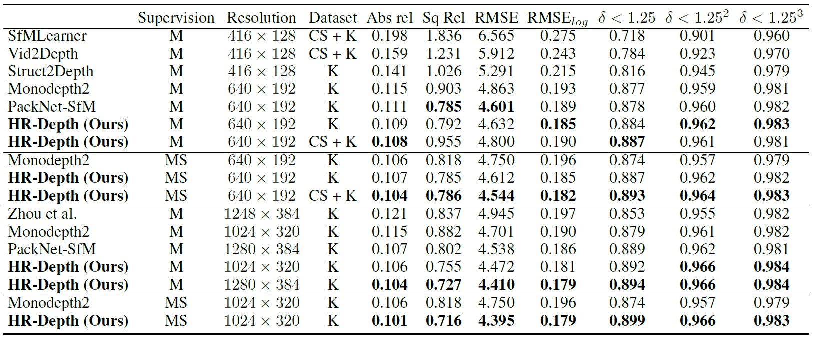
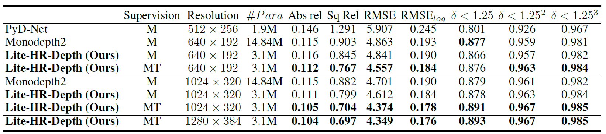

# HR-Depth: High Resolution Self-Supervised Monocular Depth Estimation

This is the official implementation for training and testing depth estimation using the model proposed in

>HR-Depth: High Resolution Self-Supervised Monocular Depth Estimation
>
>Xiaoyang Lyu, Liang Liu, Mengmeng Wang, Xin Kong, Lina Liu, Yong Liu*, Xinxin Chen and Yi Yuan.

This paper has been accepted by AAAI 2021.


**Note:** We temporarily release the evaluation version and some pretrained models of our paper. The training codes are modified according to [Monodepth2](https://github.com/nianticlabs/monodepth2), and we will release them soon. 

# Update
**2021.1.27**
1. The training code will be released around the beginning of the March.
2. For re-implementing HR-Depth, you can clone [Monodepth2](https://github.com/nianticlabs/monodepth2) and simply replace the `DepthDecoder` with `HRDepthDecoder`. Our parameter settings are exactly the same as Monodepth2. 
3. In our paper, we wrote the initial learning rate wrong. It should be **1e-4**, not **1e-3**. We will fix this mistake in the final version. Thanks for someone pointing out our problem.
# Quantitative Results

## HR-Depth Results



## Lite-HR-Depth Results



# Usage

## Requirements

Assuming a fresh Anaconda distribution, you can install the dependencies with:

```shell
conda install pytorch=1.5.0 torchvision=0.6.0 -c pytorch
conda install opencv=4.2
pip install scipy=1.4.1
```

## Pretrained Model

We provided pretrained model as follow:

| Model Name                                                   | Resolution      | Dataset | Supervision | Abs_Rel | $\delta<1.25$ | $\delta<1.25^2$ | $\delta<1.25^3$ |
| ------------------------------------------------------------ | --------------- | ------- | ----------- | ------- | ------------- | --------------- | --------------- |
| [HR_Depth_CS_K_MS_$640\times192$](http://hr-depth-pretrain-model.s3.amazonaws.com/HR_Depth_CS_K_MS_640x192.zip) | $640\times192$  | CS+K    | MS          | 0.104   | 0.893         | 0.964           | 0.983           |
| [HR_Depth_K_MS_$1024\times320$](http://hr-depth-pretrain-model.s3.amazonaws.com/HR_Depth_K_MS_1024x320.zip) | $1024\times320$ | K       | MS          | 0.101   | 0.899         | 0.966           | 0.983           |
| [HR_Depth_K_M_$1280\times384$](http://hr-depth-pretrain-model.s3.amazonaws.com/HR_Depth_K_M_1280x384.zip) | $1280\times384$ | K       | M           | 0.104   | 0.894         | 0.966           | 0.984           |
| [Lite_HR_Depth_K_T_$1280\times384$](http://hr-depth-pretrain-model.s3.amazonaws.com/Lite_HR_Depth_K_T_1280x384.zip) | $1280\times384$ | K       | T           | 0.104   | 0.893         | 0.967           | 0.985           |

## KITTI training data

You can download the entire [KITTI_raw dataset]() by running:

```shell
wget -i splits/kitti_archives_to_download.txt -P kitti_data/
```

Then unzip with

```shell
cd kitti_data
unzip "*.zip"
cd ..
```

<font color=red>**Warning:**</font> <font color=red>The size of this dataset is about 175GB, so make sure you have enough space to unzip them.</font>

## KITTI evaluation

`--data_path`:  **path of KITTI dataset**
`--load_weights_folder`: **path of models**
`--HR_Depth`: **inference by HR-Depth**
`--Lite_HR_Depth`: **inference by Lite-HR-Depth**

To prepare the ground truth depth maps run:

```shell
python export_gt_depth.py --data_path ./kitti_RAW
```

assuming that you have placed the KITTI RAW dataset in the default location of `./kitti_data`.

For HR-Depth:

```shell
python evaluate_depth.py --data_path ./kitti_RAW --load_weights_folder ./models/HR_Depth_CS_K_MS_640x192 --HR_Depth

python evaluate_depth.py --data_path ./kitti_RAW --load_weights_folder ./models/HR_Depth_K_M_1280x384 --HR_Depth 
```

For Lite-HR-Depth:

```shell
python evaluate_depth.py --data_path ./kitti_RAW --load_weights_folder ./models/Lite_HR_Depth_K_T_1280x384 --Lite_HR_Depth
```

