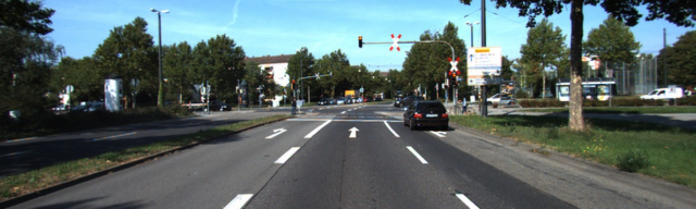
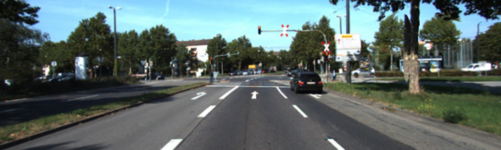
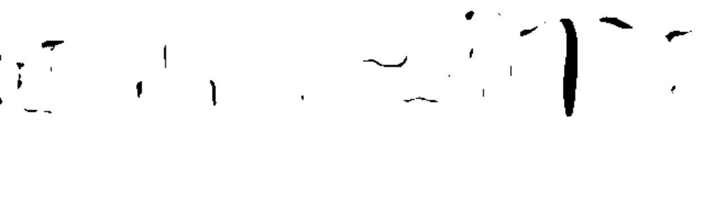

# Monodepth2

This repository contains the implementation of the methods described in

> **[Improving Self-Supervised Single View Depth Estimation by Masking Occlusion](https://arxiv.org/abs/1908.11112)**

We introduce an occlusion mask, that during training specifically ignores regions that cannot be reconstructed due to occlusions and prevents them from being used in the supervisory signal.

The implementation is a modified version of [Monodepth2](https://github.com/nianticlabs/monodepth2).

<p align="center">
  
</p>
<p align="center">
  
</p>
<p align="center">
  
</p>

## ⚙ Setup

You can refer to the [README](https://github.com/nianticlabs/monodepth2/blob/master/README.md) from the original project to setup the required environment.

## 🖼️ Prediction for a single image

You can predict depth for a single image with:
```shell
python test_simple.py --image_path assets/test_image.jpg --model_name non_occluded_min_640x192
```

On its first run this will download the `non_occluded_min_640x192` pretrained model (99MB) into the `models/` folder.
We provide the following  options for `--model_name`:


| `--model_name`          | Photometric loss | Occlusion mask | Model resolution  | KITTI abs. rel. error |  delta < 1.25  |
|-------------------------|-------------------|--------------------------|-----------------|------|----------------|
|          | Average reprojection              | No | 640 x 192                | 0.117                 | 0.870          |
| [`non_occluded_avg_640x192`](https://drive.google.com/uc?id=1JgcoiOVFX0ytfruCDeCtQ0SqJEMJetbY&export=download)          | Non-occluded avg. reprojection              | Yes | 640 x 192                | 0.117                 | 0.874          |
|||
| [`mono_640x192`](https://storage.googleapis.com/niantic-lon-static/research/monodepth2/mono_640x192.zip)          | Per-pixel min. reprojection              | No | 640 x 192                | 0.115                 | 0.877          |
| [`non_occluded_min_640x192`](https://drive.google.com/uc?id=1oOKCqym06lrM4DF7ye6UCFoT2lH0N3W_&export=download)          | Non-occluded min. reprojection              | Yes | 640 x 192                | 0.113                  | 0.878          |
