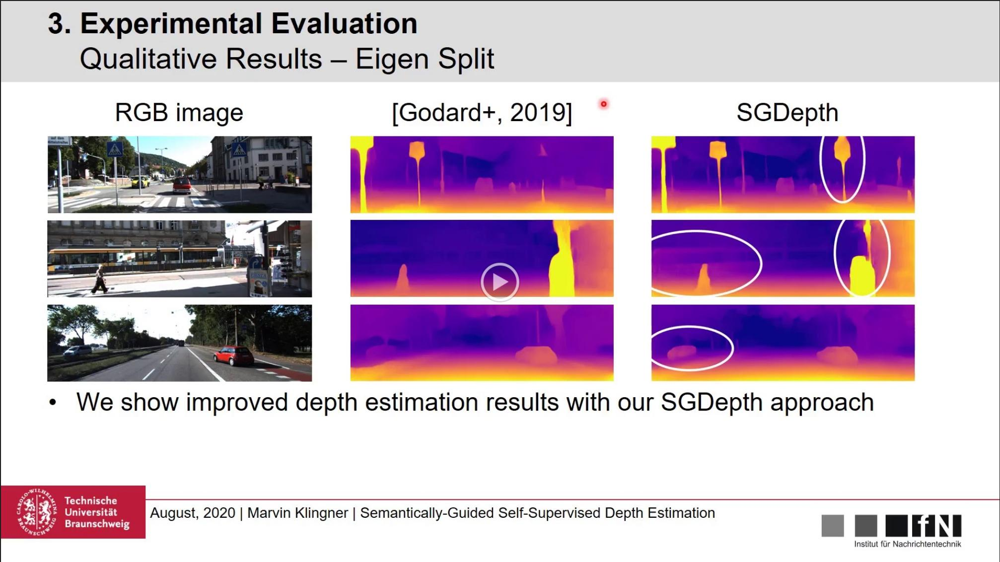
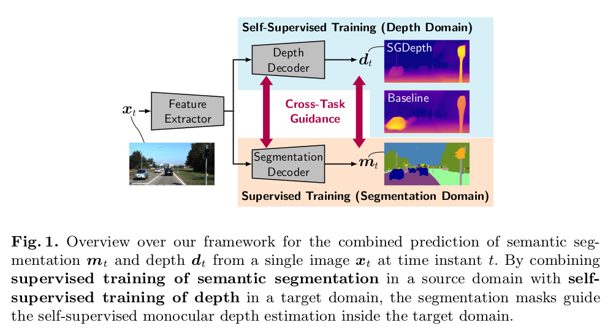
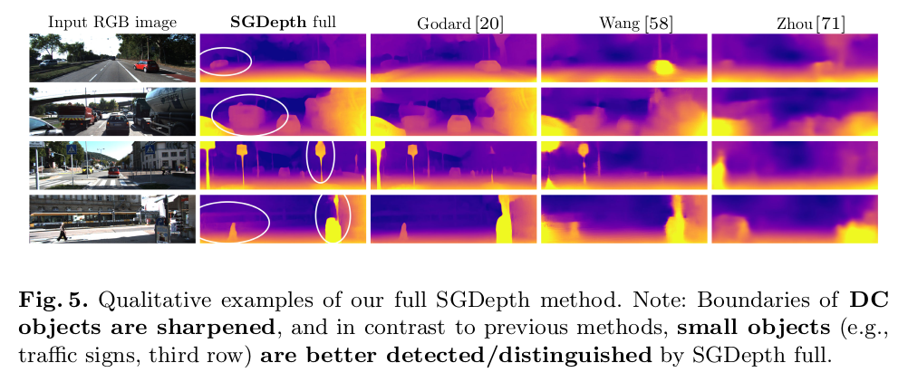

# Self-Supervised Monocular Depth Estimation: Solving the Dynamic Object Problem by Semantic Guidance

[Marvin Klingner](https://www.tu-braunschweig.de/en/ifn/institute/team/sv/klingner), [Jan-Aike Termöhlen](https://www.tu-braunschweig.de/en/ifn/institute/team/sv/termoehlen), Jonas Mikolajczyk, and [Tim Fingscheidt](https://www.tu-braunschweig.de/en/ifn/institute/team/sv/fingscheidt) – ECCV 2020


[Link to paper](https://arxiv.org/abs/2007.06936)  

## ECCV Presentation
<p align="center">
  <a href="https://drive.google.com/file/d/1ZasoGhjkVP7crZGn1fMenT4yjv8rEYAW/view">
  
  </a>
</p>

## Idea Behind the Method

Self-supervised monocular depth estimation usually relies on the assumption of a static world during training which is violated by dynamic objects. 
In our paper we introduce a multi-task learning framework that semantically guides the self-supervised depth estimation to handle such objects.

<p align="center">
  
</p>

## Citation

If you find our work useful or interesting, please consider citing [our paper](https://arxiv.org/abs/2007.06936):

```
@inproceedings{klingner2020selfsupervised,
 title   = {{Self-Supervised Monocular Depth Estimation: Solving the Dynamic Object Problem by Semantic Guidance}},
 author  = {Marvin Klingner and
            Jan-Aike Term\"{o}hlen and
            Jonas Mikolajczyk and
            Tim Fingscheidt
           },
 booktitle = {{European Conference on Computer Vision ({ECCV})}},
 year = {2020}
}
```

## Improved Depth Estimation Results

As a consequence of the multi-task training, dynamic objects are more clearly shaped and small objects such as traffic signs or traffic lights are better recognised in comparison to previous methods.

<p align="center">
  
</p>

## Our models

|        Model       | Resolution |  Abs Rel | Sq Rel |  RMSE | RMSE log | δ < 1.25 | δ < 1.25^2 | δ < 1.25^3 |
|:------------------:|:----------:|:-------:|:------:|:-----:|:--------:|----------|------------|------------|
| [SGDepth only depth](https://drive.google.com/file/d/1KMabblEyvIEFKl4yEueiEKTa-LNGKqE2/view?usp=sharing)  | 640x192   | 0.117   | 0.907  | 4.844 | 0.196    | 0.875    | 0.958      | 0.980      |
| [SGDepth full](https://drive.google.com/file/d/1Hd5YTIhSMttAVWyE7a08r3GHlHDX1Z46/view?usp=sharing)       | 640x192   | 0.113   | 0.835  | 4.693 | 0.191    | 0.879    | 0.961      | 0.981      |


### Inference Preview:
<p align="center">
  
</p>

## Prerequisites and Requirements
We recommend to use Anaconda. An `environment.yml` file is provided.
We use PyTorch 1.1 with Cuda 10.0. An `requirements.txt` also exists. Older and newer versions of mentioned packages *may* also work. However, from pytorch 1.3 on, the default behaviour of some functions (e.g. ``grid_sample()``) did change, which needs to be considered when training models with the newest pytorch releases.
To start working with our code, do the following steps:

1. In your project dir export the environment variable for the checkpoints: ```export IFN_DIR_CHECKPOINT=/path/to/folder/Checkpoints```
2. Download the Cityscapes dataset: *https://www.cityscapes-dataset.com/* and put it in a folder "Dataset"
3. Download KITTI dataset: *http://www.cvlibs.net/datasets/kitti/* and place it in the same dataset folder. To ensure that you have the same folder structure as we have, you can directly use the script ``dataloader\data_preprocessing\download_kitti.py``.
4. If you want to evaluate on the KITTI 2015 stereo dataset, also download it from *http://www.cvlibs.net/datasets/kitti/* and apply the ``dataloader\data_preprocessing\kitti_2015_generate_depth.py`` to generate the depth maps.
5. Prepare the dataset folder:
    - export an environment variable to the root directory of all datasets: ```export IFN_DIR_DATASET=/path/to/folder/Dataset```
    - Place the <a href="https://drive.google.com/drive/folders/1Ky66UBRtMCBgu2qp6Nchd9psZkDgeuyT">json files</a> in your ```cityscapes``` folder. Please take care, that the folder is spelled exactly as given here: ```"cityscapes"```.
    - Place the <a href="https://drive.google.com/drive/folders/1Qmb31xqcLAR9DgicN9Lo5GNxXujuyK5N">json files</a> in your ```kitti``` folder. Please take care, that the folder is spelled exactly as given here: ```"kitti"```.
    - Place the <a href="https://drive.google.com/drive/folders/1sLJQM3VZWFG44lHbPaTnr6EVu3d3ksMX">json files</a> in your ```kitti_zhou_split``` folder. Please take care, that the folder is spelled exactly as given here: ```"kitti_zhou_split"```.
    - Place the <a href="https://drive.google.com/drive/folders/1CkqRlKdFyCTi5nEvSUjfTL3wHl_9qPjm">json files</a> in your ```kitti_kitti_split``` folder. Please take care, that the folder is spelled exactly as given here: ```"kitti_kitti_split"```.
    - Place the <a href="https://drive.google.com/drive/folders/1vpZGir2teKx1ZBALy5LQb9oXwSXQmWqx">json files</a> in your ```kitti_2015``` folder containing the KITTI 2015 Stereo dataset. Please take care, that the folder is spelled exactly as given here: ```"kitti_2015"```.

For further information please also refer to our dataloader: <a href="https://github.com/ifnspaml/IFN_Dataloader"> Dataloader Repository </a>

## Inference
The inference script is working independently. It just imports the model and the arguments.
It inferences all images in a given directory and outputs them to defined directory.
```
python3 inference.py \       
                    --model-path sgdepth_eccv_test/zhou_full/epoch_20/model.pth \
                    --inference-resize-height 192 \
                    --inference-resize-width 640 \
                    --image-path /path/to/input/dir \
                    --output-path /path/to/output/dir
```
You can also define output with `--output-format .png` or `.jpg`.


## Depth Evaluation
For evaluation of the predicted depth use `eval_depth.py`. 
Specify which model to use with the `--model-name` and the `--model-load` flag. The path is relative from the exported checkpoint directory.
An example is shown below:
```
python3 eval_depth.py\
        --sys-best-effort-determinism \
        --model-name "eval_kitti_depth" \
        --model-load sgdepth_eccv_test/zhou_full/checkpoints/epoch_20 \
        --depth-validation-loaders "kitti_zhou_test"
```
Additionally an example script is shown in `eval_depth.sh`

## Segmentation Evaluation
For the evaluation of the segmentation results on Cityscapes use the `eval_segmentation.py`

```
python3 eval_segmentation.py \
        --sys-best-effort-determinism \
        --model-name "eval_kitti_seg" \
        --model-load sgdepth_eccv_test/zhou_full/checkpoints/epoch_20 \
        --segmentation-validation-loaders "cityscapes_validation" \ 
        --segmentation-validation-resize-width 1024 
        --segmentation-validation-resize-height 512 \
        --eval-num-images 1
```
Additionally an example script is shown in `eval_segmentation.sh`

## Training
To train the model use `train.py`:
```
python3 train.py \
        --model-name zhou_full \
        --depth-training-loaders "kitti_zhou_train" \
        --train-batches-per-epoch 7293 \
        --masking-enable \
        --masking-from-epoch 15 \
        --masking-linear-increase
```
If you have any questions feel free to contact us! 

## License
This code is licensed under the <b>MIT-License</b> feel free to use it within the boundaries of this license.
