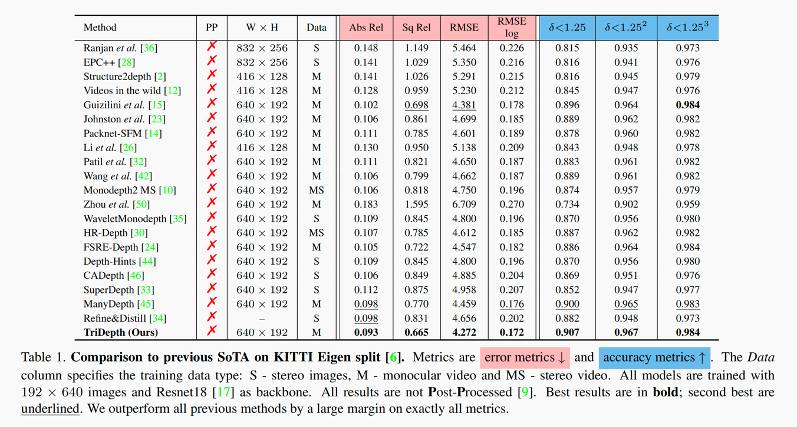
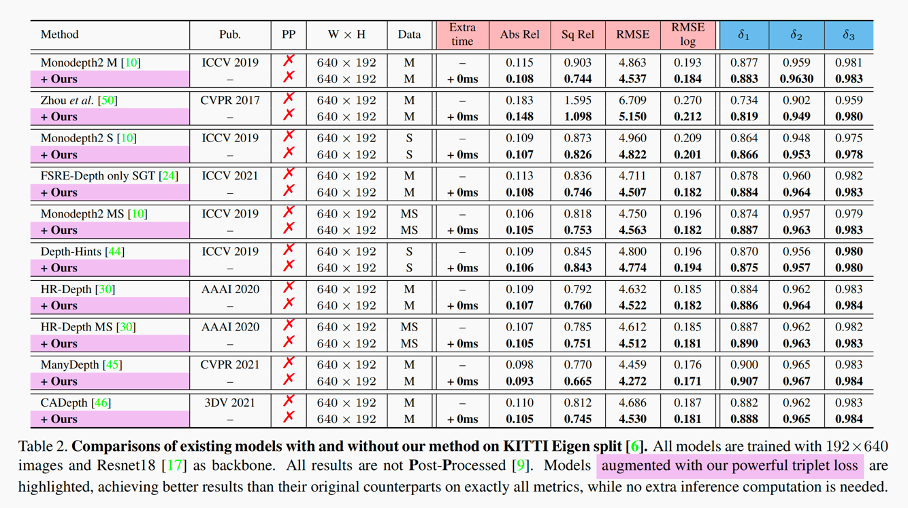

# TriDepth

The official Pytorch implementation of the paper "[Self-Supervised Monocular Depth Estimation: Solving the Edge-Fattening Problem](https://arxiv.org/abs/2210.00411)" (**WACV 2023**)

We introduce **TriDepth**, a high-performance depth estimator with a highly generalizable redesigned triplet loss.

## 📈 Results

#### State-of-the-Art Performance:

#### Also Highly Generalizable:

## ✏️ Citation

If you find our work useful or interesting, please consider citing [our paper](https://arxiv.org/abs/2210.00411).

## 👀 Training

[Pretrained model (640x192)](https://drive.google.com/file/d/1B75fdPv4lhFQ25Ba7l0gzscPg91mQUZC/view?usp=sharing) is now available!!

